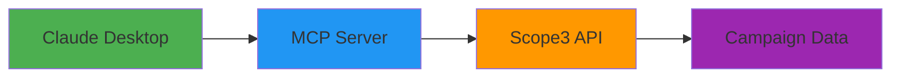

The Model Context Protocol (MCP) enables seamless integration with AI assistants like Claude Desktop and ChatGPT, providing natural language access to the full Scope3 Campaign API.

## Overview

MCP transforms the Scope3 API into a **conversational toolkit** that AI assistants can use to:

- 🗣️ **Natural Language Interface**: "How's my Nike campaign performing?"
- 🤖 **Intelligent Responses**: Rich summaries with insights and recommendations
- 🔄 **Complex Workflows**: Multi-step campaign management through conversation
- 📊 **Smart Analytics**: AI-powered analysis of campaign performance data
- ⚡ **Real-time Integration**: Instant access to live campaign data

<Note>
MCP is perfect for marketers, campaign managers, and business users who prefer conversational interfaces over API calls.
</Note>

## Architecture



The MCP server acts as a bridge between AI assistants and the Scope3 API, translating natural language requests into API calls and formatting responses for conversational use.

## Quick Setup

### 1. Install MCP Server

<Tabs>
  <Tab title="npm">
    ```bash
    npm install -g @scope3/campaign-api-mcp
    ```
  </Tab>
  <Tab title="Local Development">
    ```bash
    # Clone the repository
    git clone https://github.com/scope3/campaign-api-mcp
    cd campaign-api-mcp
    
    # Install dependencies
    npm install
    
    # Build the project
    npm run build
    
    # Start the server
    npm start
    ```
  </Tab>
  <Tab title="Docker">
    ```bash
    docker run -d \
      --name scope3-mcp \
      -p 3001:3001 \
      -e SCOPE3_API_KEY=your_api_key \
      scope3/campaign-api-mcp:latest
    ```
  </Tab>
</Tabs>

### 2. Configure Environment

Set your Scope3 API key:

```bash
export SCOPE3_API_KEY="your_scope3_api_key_here"
```

Or create a `.env` file:

```bash
# .env file
SCOPE3_API_KEY=your_scope3_api_key_here
PORT=3001
LOG_LEVEL=info
```

### 3. Start MCP Server

```bash
npm start
```

The server will start on port 3001 by default. You should see:

```
🚀 Scope3 Campaign API MCP Server running on port 3001
✅ Successfully connected to Scope3 API
📡 MCP endpoint available at http://localhost:3001/mcp
🩺 Health check available at http://localhost:3001/health
```

## Claude Desktop Integration

### Configuration

Add the MCP server to your Claude Desktop configuration:

<Tabs>
  <Tab title="macOS">
    **Location:** `~/Library/Application Support/Claude/claude_desktop_config.json`
    
    ```json
    {
      "mcpServers": {
        "scope3-campaign-api": {
          "command": "node",
          "args": ["/path/to/scope3-campaign-api/dist/server.js"],
          "env": {
            "SCOPE3_API_KEY": "your_api_key_here"
          }
        }
      }
    }
    ```
  </Tab>
  <Tab title="Windows">
    **Location:** `%APPDATA%\Claude\claude_desktop_config.json`
    
    ```json
    {
      "mcpServers": {
        "scope3-campaign-api": {
          "command": "node",
          "args": ["C:\\path\\to\\scope3-campaign-api\\dist\\server.js"],
          "env": {
            "SCOPE3_API_KEY": "your_api_key_here"
          }
        }
      }
    }
    ```
  </Tab>
  <Tab title="HTTP Mode">
    If running the server separately:
    
    ```json
    {
      "mcpServers": {
        "scope3-campaign-api": {
          "command": "node",
          "args": ["-e", "require('@scope3/campaign-api-mcp').startHttpServer()"],
          "env": {
            "SCOPE3_API_KEY": "your_api_key_here",
            "MCP_SERVER_URL": "http://localhost:3001/mcp"
          }
        }
      }
    }
    ```
  </Tab>
</Tabs>

### Restart Claude Desktop

After updating the configuration:

1. **Quit Claude Desktop** completely
2. **Restart Claude Desktop**
3. **Test the connection** by asking: "Check my Scope3 authentication status"

### Verification

Claude should respond with something like:

```
✅ Successfully connected to Scope3 Campaign API
👤 Authenticated as: user@company.com
🏢 Organization: Acme Marketing
🔧 Available tools: 25 campaign management tools loaded
📊 API Status: All systems operational
```

## Available Conversational Commands

### Authentication & Status

```
"Check my authentication status"
"Am I connected to Scope3?"
"Show me available tools"
```

### Brand Agent Management

```
"Create a brand agent for Nike" 
"List all my brand agents"
"Delete the test brand agent"
"Show me details for brand agent ba_abc123"
```

### Campaign Management

```
"Create a $50,000 campaign for Nike targeting sports fans"
"Show me all campaigns for my Nike brand agent"
"Update my holiday campaign budget to $75,000" 
"Pause the underperforming campaign"
```

### Performance Monitoring

```
"How's my Nike campaign performing?"
"Show me a detailed performance summary for campaign camp_abc123"
"Which tactics are working best?"
"Send me alerts when my campaign has pacing problems"
```

### Data Export

```
"Export campaign data for December as CSV"
"Get performance data grouped by tactic and signal"
"Download all event data for last month"
```

### Creative & Asset Management

```
"Add a video creative called 'Holiday Sale' to Nike"
"List all creatives for my brand agent"
"Update the summer campaign creative"
```

## Advanced Configuration

### Custom Server Settings

```javascript
// server.config.js
module.exports = {
  port: process.env.PORT || 3001,
  scope3: {
    apiKey: process.env.SCOPE3_API_KEY,
    baseUrl: process.env.SCOPE3_BASE_URL || 'https://api.agentic.scope3.com',
    timeout: 30000,
    retries: 3
  },
  mcp: {
    name: 'Scope3 Campaign API',
    version: '1.0.0',
    tools: {
      // Enable/disable specific tools
      brandAgents: true,
      campaigns: true,
      creatives: true,
      reporting: true,
      webhooks: true
    }
  },
  logging: {
    level: process.env.LOG_LEVEL || 'info',
    format: 'pretty'  // or 'json'
  }
};
```

### Environment-Specific Configuration

<Tabs>
  <Tab title="Development">
    ```bash
    # development.env
    SCOPE3_API_KEY=sk_dev_your_key_here
    SCOPE3_BASE_URL=https://api-dev.agentic.scope3.com
    LOG_LEVEL=debug
    MCP_SERVER_NAME=Scope3 Campaign API (Dev)
    ```
  </Tab>
  <Tab title="Staging">
    ```bash  
    # staging.env
    SCOPE3_API_KEY=sk_staging_your_key_here
    SCOPE3_BASE_URL=https://api-staging.agentic.scope3.com
    LOG_LEVEL=info
    MCP_SERVER_NAME=Scope3 Campaign API (Staging)
    ```
  </Tab>
  <Tab title="Production">
    ```bash
    # production.env
    SCOPE3_API_KEY=sk_prod_your_key_here
    SCOPE3_BASE_URL=https://api.agentic.scope3.com
    LOG_LEVEL=warn
    MCP_SERVER_NAME=Scope3 Campaign API
    ```
  </Tab>
</Tabs>

### Custom Tool Configuration

```javascript
// Disable specific tools for security or workflow reasons
const mcpConfig = {
  tools: {
    // Core functionality
    brandAgents: {
      create: true,
      update: true,
      delete: false,  // Disable deletion in production
      list: true,
      get: true
    },
    campaigns: {
      create: true,
      update: true,
      list: true
    },
    // Advanced features
    reporting: {
      summary: true,
      export: true,
      analyze: false,  // Disable for non-power users
      webhooks: false  // Disable webhook management
    }
  }
};
```

## Integration with Other AI Platforms

### OpenAI GPT Integration

<Tabs>
  <Tab title="GPT Builder">
    1. **Create Custom GPT** in ChatGPT Plus
    2. **Add Action Schema**:
    ```yaml
    openapi: 3.0.0
    info:
      title: Scope3 Campaign API
      version: 1.0.0
    servers:
      - url: http://localhost:3001
    paths:
      /mcp:
        post:
          operationId: mcpRequest
          requestBody:
            required: true
            content:
              application/json:
                schema:
                  type: object
    ```
    3. **Configure Authentication** with API key
    4. **Test Integration** with sample requests
  </Tab>
  <Tab title="API Integration">
    ```javascript
    // Direct API integration for custom applications
    const openai = new OpenAI({
      apiKey: process.env.OPENAI_API_KEY,
    });
    
    const mcpProxy = async (userMessage) => {
      const mcpResponse = await fetch('http://localhost:3001/mcp', {
        method: 'POST',
        headers: { 'Content-Type': 'application/json' },
        body: JSON.stringify({
          method: 'tools/call',
          params: {
            name: 'get_campaign_summary',
            arguments: { campaignId: 'camp_abc123' }
          }
        })
      });
      
      const data = await mcpResponse.json();
      
      return openai.chat.completions.create({
        model: 'gpt-4',
        messages: [
          { role: 'system', content: 'You are a Scope3 campaign assistant.' },
          { role: 'user', content: userMessage },
          { role: 'assistant', content: JSON.stringify(data) }
        ]
      });
    };
    ```
  </Tab>
</Tabs>

### Microsoft Copilot Integration

```typescript
// Microsoft Graph integration
import { Client } from '@microsoft/microsoft-graph-client';

class Scope3CopilotPlugin {
  constructor(private graphClient: Client) {}
  
  async handleCampaignQuery(query: string) {
    // Process natural language query
    const intent = await this.parseIntent(query);
    
    // Call MCP server
    const mcpResponse = await fetch('http://localhost:3001/mcp', {
      method: 'POST',
      headers: { 'Content-Type': 'application/json' },
      body: JSON.stringify({
        method: 'tools/call',
        params: {
          name: intent.toolName,
          arguments: intent.parameters
        }
      })
    });
    
    const data = await mcpResponse.json();
    
    // Format for Copilot
    return this.formatForCopilot(data);
  }
}
```

## Troubleshooting

### Common Issues

<AccordionGroup>
  <Accordion title="Claude Desktop not connecting to MCP server">
    **Solutions:**
    1. Check that the server is running: `curl http://localhost:3001/health`
    2. Verify configuration file location and syntax
    3. Restart Claude Desktop after configuration changes
    4. Check logs: `tail -f ~/.claude/logs/claude_desktop.log`
    
    **Debug commands:**
    ```bash
    # Test MCP endpoint directly
    curl -X POST http://localhost:3001/mcp \
      -H "Content-Type: application/json" \
      -d '{"method": "initialize", "params": {}}'
    ```
  </Accordion>
  
  <Accordion title="Authentication errors">
    **Check:**
    - API key is valid and not expired
    - Environment variables are set correctly  
    - No extra whitespace in API key
    
    **Test authentication:**
    ```bash
    curl -H "x-scope3-api-key: YOUR_KEY" \
         https://api.agentic.scope3.com/auth/check
    ```
  </Accordion>
  
  <Accordion title="Tools not showing up in Claude">
    **Solutions:**
    1. Restart Claude Desktop
    2. Check server logs for tool registration errors
    3. Verify tool configuration in server settings
    
    **Debug:**
    ```bash
    # Check available tools
    curl -X POST http://localhost:3001/mcp \
      -H "Content-Type: application/json" \
      -d '{"method": "tools/list", "params": {}}'
    ```
  </Accordion>
  
  <Accordion title="Slow response times">
    **Optimization:**
    - Enable response caching
    - Increase timeout values
    - Use brief verbosity for frequent requests
    
    ```javascript
    // server.config.js
    module.exports = {
      cache: {
        enabled: true,
        ttl: 300  // 5 minutes
      },
      timeouts: {
        api: 30000,
        tool: 60000
      }
    };
    ```
  </Accordion>
</AccordionGroup>

### Debug Mode

Enable detailed logging for troubleshooting:

```bash
# Start server in debug mode
DEBUG=scope3:* npm start

# Or set log level
LOG_LEVEL=debug npm start
```

Debug output includes:
- API request/response details
- Tool execution traces
- MCP protocol messages
- Performance metrics

### Health Checks

The MCP server includes comprehensive health monitoring:

```bash
# Basic health check
curl http://localhost:3001/health

# Detailed status
curl http://localhost:3001/status
```

```json
{
  "status": "healthy",
  "timestamp": "2024-12-07T10:30:00Z",
  "checks": {
    "scope3_api": "ok",
    "mcp_server": "ok", 
    "tools_loaded": "ok"
  },
  "metrics": {
    "uptime": 3600,
    "total_requests": 147,
    "average_response_time": 245,
    "active_connections": 1
  }
}
```

## Production Deployment

### Docker Deployment

```dockerfile
FROM node:18-alpine

WORKDIR /app

COPY package*.json ./
RUN npm ci --only=production

COPY dist/ ./dist/

EXPOSE 3001

HEALTHCHECK --interval=30s --timeout=3s --start-period=5s --retries=3 \
  CMD curl -f http://localhost:3001/health || exit 1

USER node

CMD ["node", "dist/server.js"]
```

### Kubernetes Configuration

```yaml
apiVersion: apps/v1
kind: Deployment
metadata:
  name: scope3-mcp-server
spec:
  replicas: 2
  selector:
    matchLabels:
      app: scope3-mcp-server
  template:
    metadata:
      labels:
        app: scope3-mcp-server
    spec:
      containers:
      - name: mcp-server
        image: scope3/campaign-api-mcp:latest
        ports:
        - containerPort: 3001
        env:
        - name: SCOPE3_API_KEY
          valueFrom:
            secretKeyRef:
              name: scope3-secrets
              key: api-key
        livenessProbe:
          httpGet:
            path: /health
            port: 3001
          initialDelaySeconds: 30
        readinessProbe:
          httpGet:
            path: /ready
            port: 3001
          initialDelaySeconds: 5

---
apiVersion: v1
kind: Service
metadata:
  name: scope3-mcp-service
spec:
  selector:
    app: scope3-mcp-server
  ports:
  - port: 80
    targetPort: 3001
```

### Security Considerations

```javascript
// production-security.js
const helmet = require('helmet');
const rateLimit = require('express-rate-limit');

// Security middleware
app.use(helmet({
  contentSecurityPolicy: {
    directives: {
      defaultSrc: ["'self'"],
      scriptSrc: ["'self'"],
      styleSrc: ["'self'", "'unsafe-inline'"],
    }
  }
}));

// Rate limiting
const limiter = rateLimit({
  windowMs: 15 * 60 * 1000, // 15 minutes
  max: 100, // limit each IP to 100 requests per windowMs
  message: 'Too many requests from this IP'
});

app.use('/mcp', limiter);

// API key validation
app.use((req, res, next) => {
  if (!process.env.SCOPE3_API_KEY) {
    return res.status(500).json({ 
      error: 'Server configuration error: API key not configured' 
    });
  }
  next();
});
```

## Next Steps

<CardGroup cols={2}>
  <Card title="Conversational Examples" href="/mcp/conversational-examples" icon="message-circle">
    Learn advanced conversational patterns and workflows
  </Card>
  <Card title="Casual User Guide" href="/guides/casual-users" icon="user">
    Complete guide for non-technical users
  </Card>
  <Card title="Claude Desktop" href="/mcp/claude-desktop" icon="desktop">
    Detailed Claude Desktop integration setup
  </Card>
  <Card title="API Reference" href="/api-reference/brand-agents/create-brand-agent" icon="book">
    Complete reference for all available tools
  </Card>
</CardGroup>