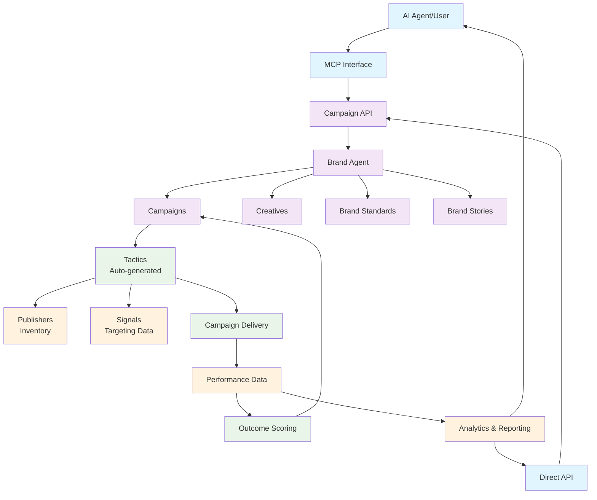
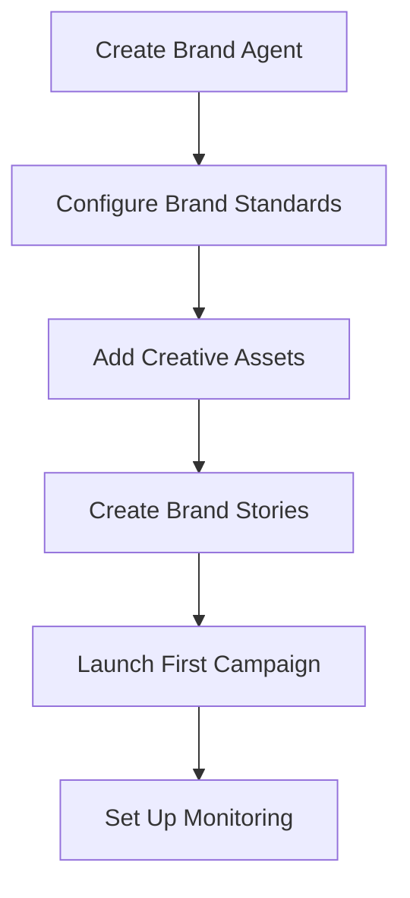
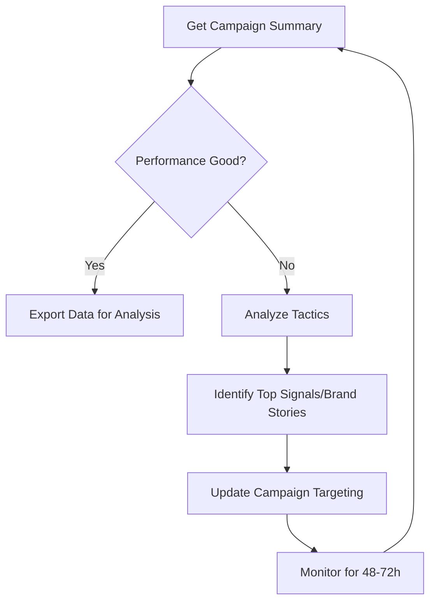
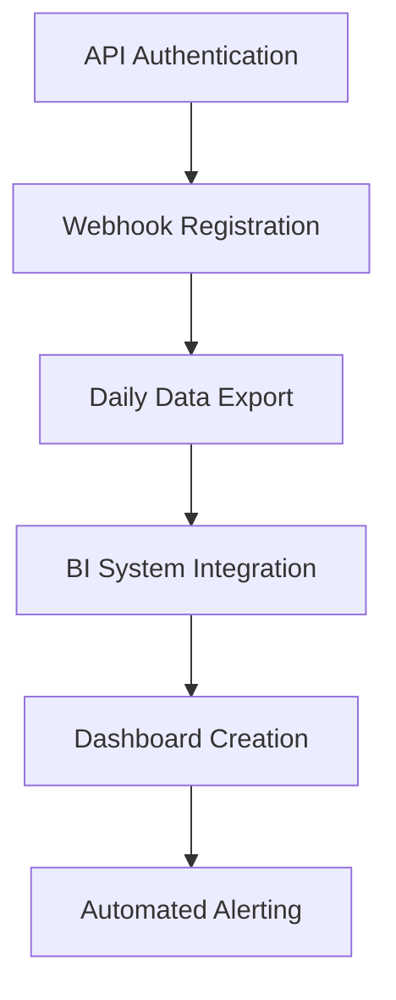

## Architecture Overview

The Scope3 Campaign API is built around a **Brand Agent** architecture that mirrors how programmatic advertising actually works in the industry.



### Why Brand Agents?

Every major programmatic platform uses an account-based hierarchy:
- **Google Ads**: Advertiser Account → Campaigns  
- **The Trade Desk**: Advertiser → Campaigns
- **Facebook Business**: Ad Account → Campaigns

Brand agents serve as your advertiser account, owning all marketing assets and campaigns.

### Platform Migration Reference

If you're migrating from other platforms, here are the key concept mappings:

| Scope3 Concept | The Trade Desk | Display & Video 360 | Amazon DSP | Meta Business |
|----------------|----------------|---------------------|-------------|---------------|
| **Brand Agent** | Advertiser | Advertiser | Account | Ad Account |
| **Campaign** | Line Item | Insertion Order | Order | Campaign |
| **Creative** | Creative | Asset | Creative | Ad Creative |
| **Signal** | Data Element | First-Party Data | Audience Signal | Custom Audience |
| **Brand Story** | Audience Segment | Audience | Lifestyle Segment | Lookalike Audience |
| **Tactic** | Deal/Strategy | Targeting Combo | Optimization Strategy | Ad Set |

<Note>
**Migration Tip**: Start by creating one Brand Agent per advertiser account you currently manage. Most of your existing campaign structure can map directly to Scope3 campaigns.
</Note>

## Core Concepts

### Brand Agent
Your advertiser account that owns all resources. Think of it as your marketing organization within Scope3.

```
Brand Agent: "Nike"
├── Campaigns: Holiday Sale, Summer Launch, Back to School
│   └── Tactics: Auto-generated inventory + signal combinations
├── Creatives: Video ads, display banners, native content
├── Brand Stories: Performance-focused, lifestyle-oriented audiences
├── Brand Standards: Safety rules, blocked domains
└── Outcome Scoring: Performance measurement and optimization
```

**When to create:** One per advertiser/brand. Most organizations have 1-3 brand agents.

### Campaigns  
Marketing initiatives with specific budgets, targeting, and optimization goals.

<Tabs>
  <Tab title="Campaign Properties">
    - **Budget**: Total spend and pacing rules
    - **Targeting**: Who to reach (via signals and brand stories)
    - **Creative**: What content to show (via creative assets)
    - **Optimization**: How to improve performance (via tactics)
    - **Delivery**: Real-time spend and performance tracking
  </Tab>
  <Tab title="Campaign States">
    - **Scheduled**: Created but not yet started
    - **Delivering**: Live and spending budget
    - **Paused**: Temporarily stopped
    - **Completed**: Ended (by budget or schedule)
  </Tab>
</Tabs>

### Creatives
Your actual ad content - videos, images, text, or interactive media.

| Type | Use Case | Example |
|------|----------|---------|
| **Video** | CTV, YouTube, social | 30-second brand spot |
| **Image** | Display, social, native | Product photography |
| **Native** | In-feed, content marketing | Article-style ads |
| **HTML5** | Interactive, rich media | Playable game ads |

**Reusability**: Creatives can be shared across multiple campaigns within the same brand agent.

### Natural Language Campaign Creation

Unlike traditional DSPs that require manual parameter configuration, Scope3 campaigns are created using **natural language prompts** that describe your goals in plain English.

<Tabs>
  <Tab title="How It Works">
    **Agentic Campaign Management**: AI agents automatically convert your natural language instructions into technical advertising configurations.
    
    Instead of filling out forms with targeting parameters, you describe campaign goals, and AI agents handle:
    - Audience targeting configuration
    - Bidding strategy selection  
    - Creative optimization rules
    - Performance monitoring setup
  </Tab>
  <Tab title="Example Prompts">
    **Good prompts** are specific and include key details:
    
    - *"Target college students with back-to-school athletic wear, $25K budget"*
    - *"Launch premium running shoes to marathon enthusiasts in major cities"*  
    - *"Holiday gift campaign for eco-conscious parents, emphasizing sustainability"*
    - *"Retarget website visitors with 20% off coupon, focus on mobile users"*
  </Tab>
  <Tab title="Best Practices">
    **Include in your prompts:**
    - Target audience description (demographics, interests, behaviors)
    - Business objectives and success metrics
    - Geographic, demographic, or interest constraints
    - Budget and timing requirements
    - Product/service focus areas
    
    **Use business language**, not technical parameters - the AI handles the translation to programmatic settings.
  </Tab>
</Tabs>

### Tactics
Algorithm-driven optimization approaches that determine **how** your campaign buys inventory.

Each tactic combines:
- **Signals**: Data inputs for targeting (age, interests, behaviors)
- **Brand Stories**: AI-generated audience profiles that guide targeting
- **Optimization**: ML algorithms that improve performance

```
Example Tactic:
Signals: ["age_25_34", "interest_sports", "device_mobile"]
Brand Stories: ["performance", "lifestyle"]  
→ Targets mobile sports fans 25-34 with performance/lifestyle messaging
```

### Signals & Brand Stories

<Tabs>
  <Tab title="Signals">
    **What they are**: Data points used for targeting and optimization
    
    **Examples**:
    - Demographics: `age_25_34`, `income_high`
    - Interests: `interest_sports`, `interest_travel`
    - Behaviors: `purchase_intent`, `brand_affinity`
    - Context: `device_mobile`, `weekend_viewing`
    
    **Usage**: Group by signals in reports to understand which audiences perform best
  </Tab>
  <Tab title="Brand Stories">
    **What they are**: AI-generated audience profiles that guide targeting optimization
    
    **Examples**:
    - `performance`: Results-driven users focused on product benefits
    - `lifestyle`: Experience-seeking users emphasizing identity
    - `value`: Cost-conscious users motivated by savings
    - `social`: Community-oriented users influenced by social proof
    
    **Usage**: Group by brand stories to see which AI-generated profiles perform best
  </Tab>
</Tabs>

## Data Model

### Resource Hierarchy

```
Brand Agent (ba_*)
├── Campaigns (camp_*)
│   ├── Delivery Summary (real-time performance)
│   ├── Notification Thresholds (automated alerts)
│   └── Tactics (tactic_*) - Auto-generated combinations
├── Creatives (cr_*) - Shared across campaigns  
├── Brand Stories - AI-generated audience profiles
├── Brand Standards (domain blocks, safety rules)
├── Outcome Scoring (performance measurement)
└── Webhook Subscriptions (real-time notifications)
```

### ID Patterns

All resources follow consistent ID patterns:
- Brand Agents: `ba_abc123`
- Campaigns: `camp_xyz789` 
- Creatives: `cr_def456`
- Brand Stories: `bs_ghi789`
- Tactics: `tactic_jkl012`

## Reporting Architecture

### Dual-Mode Design

The API supports two distinct reporting approaches:

<Tabs>
  <Tab title="Casual Users">
    **Natural Language Summaries**
    - Rich text responses with insights
    - Health scores and recommendations  
    - ASCII charts and visualizations
    - Conversational interface via AI assistants
    
    ```
    User: "How's my campaign doing?"
    Response: "🎯 Health Score: 87/100 (Healthy)
              📊 Spending on track, strong mobile performance..."
    ```
  </Tab>
  <Tab title="Enterprise Systems">
    **Structured Data Exports**
    - JSON/CSV/Parquet formats
    - Flexible grouping and aggregation
    - BI system integration
    - Custom date ranges and filters
    
    ```json
    {
      "campaigns": [...],
      "groupBy": ["date", "tactic", "signal"],
      "metrics": {
        "spend": 12450.00,
        "impressions": 2100000,
        "efficiency": 0.87
      }
    }
    ```
  </Tab>
</Tabs>

### Scoring Outcome Model

All campaign performance is captured as scoring outcomes for optimization:

```typescript
interface ScoringOutcome {
  campaignId: string;       // Campaign this outcome applies to
  tacticId?: string;        // Optional tactic ID for tactic-level measurement
  creativeId?: string;      // Optional creative ID for creative-level measurement
  exposureRange: {
    start: Date;            // When exposure began
    end: Date;              // When exposure ended  
  };
  performanceIndex: number; // 0 = no value, 100 = expected, 1000 = 10x expected
  source: string;           // Data source (e.g., "scope3")
  timestamp: Date;          // When outcome was recorded
}
```

This feeds into the three-component scoring system for campaign optimization.

## Integration Patterns

### MCP (Model Context Protocol)
Conversational tool framework for AI assistants like Claude and ChatGPT.

**Benefits**:
- Natural language interface
- No API knowledge required
- Rich text responses with insights
- Perfect for campaign managers and marketers

### Direct API
RESTful API with full programmatic access.

**Benefits**:
- Complete control and customization
- Integration with existing systems
- Batch operations and automation
- Real-time webhook notifications

### Webhooks
Real-time push notifications for scoring outcomes and campaign updates.

**Use cases**:
- Performance alerts and anomaly detection
- Budget pacing notifications  
- Optimization opportunity alerts
- Integration with Slack, PagerDuty, etc.

## Account Organization

### Customer ID
The billing account identifier that groups multiple brand agents under a single organization. This enables:

**Agency Management**: Multiple client brand agents under one customer account
**Enterprise Management**: Multiple brand divisions or product lines  
**Reseller Accounts**: Multiple end-client accounts under one billing relationship

```
Customer Account: "ACME Agency" 
├── Brand Agent: "Nike Global"
│   ├── Campaigns: Holiday Sale, Summer Launch
│   └── Creatives: Video ads, display banners
├── Brand Agent: "Coca-Cola US"  
│   ├── Campaigns: New Product, Seasonal
│   └── Creatives: Social content, CTV spots
└── Brand Agent: "Ford Motors"
    ├── Campaigns: F-150 Launch, Dealer Network
    └── Creatives: Vehicle showcases, lifestyle
```

All API operations are automatically scoped to your customer account for security and data isolation.

## Security & Authentication

<Tabs>
  <Tab title="API Keys">
    - Authenticate via `Authorization: Bearer` header (or legacy `x-scope3-api-key`)
    - Keys are scoped to specific organizations
    - Rate limited to 1000 requests/hour per key
    - No server-side storage - provide in each request
  </Tab>
  <Tab title="Webhook Security">
    - HTTPS endpoints required
    - HMAC signature verification
    - Bearer token authentication supported
    - Automatic retry with exponential backoff
  </Tab>
</Tabs>

## Performance & Limits

| Resource | Limit | Notes |
|----------|--------|-------|
| **API Requests** | 1,000/hour per key | Burst allowance available |
| **Webhook Retries** | 25 attempts | 2x exponential backoff |
| **Data Export Size** | 100MB inline | Larger exports via download URL |
| **Campaign Budget** | $1,000 minimum | $10,000+ recommended |
| **Creative File Size** | 50MB maximum | CDN delivery recommended |

## Best Practices

<AccordionGroup>
  <Accordion title="Brand Agent Organization">
    - **One per brand/advertiser**: Don't create multiple brand agents for the same brand
    - **Clear naming**: Use descriptive names that team members will understand
    - **Resource sharing**: Take advantage of shared creatives and brand stories across campaigns
  </Accordion>
  
  <Accordion title="Campaign Structure">
    - **Focused targeting**: Each campaign should have a clear audience and goal
    - **Sufficient budget**: $10,000+ enables meaningful ML optimization
    - **Creative variety**: Test multiple creative assets to find top performers
  </Accordion>
  
  <Accordion title="Performance Monitoring">
    - **Set up webhooks**: Get real-time alerts for important events
    - **Regular analysis**: Use tactic analysis tools to optimize signal/brand story performance  
    - **Data export**: Integrate with your BI systems for deeper analysis
  </Accordion>
</AccordionGroup>

## Common Patterns

### Setting Up a New Brand



### Optimizing Performance



### Enterprise Integration



## Next Steps

<CardGroup cols={2}>
  <Card title="Quick Start" href="/mintlify/quickstart" icon="rocket">
    Launch your first campaign in 5 minutes
  </Card>
  <Card title="Reporting & Analytics" href="/mintlify/reporting-overview" icon="chart-line">
    Campaign insights, data export, and ML-powered optimization
  </Card>
  <Card title="API Reference" href="/api-reference/brand-agents/create-brand-agent" icon="book">
    Complete documentation for all 25+ tools
  </Card>
</CardGroup>