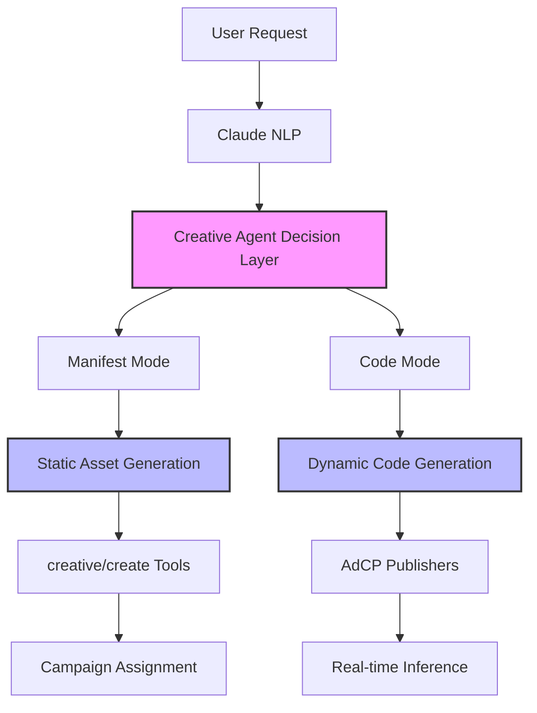

<Info>
Creative Agents provide AI-powered creative generation following AdCP PR #23. This integration enables conversational creative development and dynamic optimization.
</Info>

## What are Creative Agents?

Creative Agents are AI-powered tools that extend our creative system with intelligent automation:

<CardGroup cols={2}>

<Card title="Manifest Mode" icon="file-text">
**Static Asset Generation**
- Generate asset manifests conversationally
- Create optimized images, text, and layouts
- Follow brand guidelines automatically
- Output feeds into existing creative/create tools
</Card>

<Card title="Code Mode" icon="code">
**Dynamic Creative Generation**
- Generate executable creative code
- Real-time personalization logic
- Interactive creative elements
- Deploy to AdCP publisher network
</Card>

</CardGroup>

## Integration Architecture



## Creative Agent Capabilities

### Conversational Creative Generation

<Tabs>

<Tab title="Initial Request">
```bash
User: "Build a creative for our coffee brand targeting morning commuters"
```

**Agent Response:**
```
🤖 I'll create a morning-focused coffee ad. What format do you prefer?
Options:
- Banner ads for mobile and desktop
- Video creative for social media
- Native ad for content feeds
- Multi-format package
```
</Tab>

<Tab title="Iterative Refinement">
```bash
User: "Banner ads for mobile and desktop"
```

**Agent Response:**
```
🤖 Great! Generating responsive banner set with morning imagery...

📱 Mobile Banner (320x50):
• Hero: Steaming coffee cup with sunrise
• Text: "Start Your Day Right"
• CTA: "Order Now"

💻 Desktop Banner (728x90):  
• Hero: Coffee shop morning scene
• Text: "Premium Coffee for Your Morning Commute"
• CTA: "Find a Location"

Would you like me to adjust the messaging or imagery?
```
</Tab>

<Tab title="Finalization">
```bash
User: "Perfect! Deploy this to campaign camp_123"
```

**Agent Response:**
```
✅ Creative package generated and assigned!

🎨 Creative: "Morning Coffee Campaign"
📦 Assets: Mobile banner, Desktop banner, Brand logo
🎯 Campaign: camp_123
🚀 Status: Active and serving

Performance tracking enabled ✓
Brand guidelines compliance ✓
```
</Tab>

</Tabs>

### Advanced AI Features

<AccordionGroup>

<Accordion title="Brand Guideline Adherence" icon="palette">

Creative agents automatically follow brand guidelines:

```yaml
Brand Guidelines Integration:
  Logo Usage: ✓ Proper placement and sizing
  Color Palette: ✓ Brand colors (#FF6B6B, #4ECDC4)
  Typography: ✓ Brand fonts (Montserrat, Open Sans)
  Messaging: ✓ Tone of voice consistency
  Restrictions: ✓ No competitor mentions
```

**Example:**
```bash
"Create a creative for Starbucks following our brand guidelines"
```

Agent ensures:
- Green color scheme adherence
- Approved font usage
- Logo placement standards  
- Brand voice consistency
</Accordion>

<Accordion title="Performance Optimization" icon="chart-line">

AI optimizes creatives based on performance data:

```python
# Performance-Driven Optimization
if creative.ctr < campaign.average_ctr:
    agent.suggest_improvements([
        "Try brighter colors for better attention",
        "Shorten headline for mobile readability", 
        "Test video format for higher engagement"
    ])

if creative.conversion_rate > campaign.top_performers:
    agent.create_variants([
        "Similar style for other products",
        "Seasonal variations of successful design",
        "Cross-format adaptations"
    ])
```

</Accordion>

<Accordion title="Dynamic Personalization" icon="user-gear">

Code mode enables real-time creative adaptation:

```javascript
// Dynamic Creative Logic
const personalizeCreative = (user, context) => {
  const creative = baseTemplate.clone();
  
  // Location-based personalization
  if (user.location.weather === 'cold') {
    creative.headline = "Warm Up with Hot Coffee";
    creative.image = warmCoffeeImage;
  }
  
  // Time-based personalization  
  if (context.hour < 10) {
    creative.offer = "Morning Special: 20% Off";
  }
  
  // Behavioral personalization
  if (user.previousPurchases.includes('premium')) {
    creative.product = premiumBlend;
  }
  
  return creative;
};
```

</Accordion>

</AccordionGroup>

## Integration Workflows

### Workflow 1: Manifest Mode Integration

<Steps>

<Step title="Natural Language Request">
```bash
"Create display creatives for our holiday sale"
```
</Step>

<Step title="Creative Agent Processing">
```
🤖 Creative Agent (Manifest Mode):
• Analyzing brand guidelines ✓
• Generating asset manifest...
  - Hero image: Holiday-themed banner (1200x628)
  - Headline: "Holiday Sale - 50% Off"
  - CTA: "Shop Now"  
  - Logo: Brand logo overlay
  - Colors: Brand color palette
```
</Step>

<Step title="System Integration">
```
🔄 Integration Process:
1. Manifest → CreateCreativeInput conversion
2. Call existing creative/create tool
3. Assets generated via AdCP publishers
4. Creative ready for campaign assignment
```
</Step>

<Step title="Result">
```
✅ Creative "Holiday Sale 2024" created with 4 AI-generated assets
📦 Assets optimized for display advertising
🎯 Ready for campaign assignment
```
</Step>

</Steps>

### Workflow 2: Code Mode Integration

<Steps>

<Step title="Dynamic Creative Request">
```bash
"Create a dynamic video creative that personalizes based on user location"
```
</Step>

<Step title="Code Generation">
```javascript
🤖 Creative Agent (Code Mode):
// Generated executable creative code
const DynamicVideoCreative = {
  template: 'video_personalization_v1',
  
  personalization: {
    location: true,
    weather: true,
    timeOfDay: true
  },
  
  render: (user, context) => {
    const video = baseVideo.clone();
    video.overlayText = `${user.city} Special Offer`;
    
    if (context.weather.temp < 50) {
      video.product = 'winter_blend';
    }
    
    return video;
  }
};
```
</Step>

<Step title="Deployment">
```
🚀 Deployment Process:
1. Code registered with AdCP publishers
2. Real-time inference endpoints created
3. Creative record created with code reference
4. Dynamic creative live on publisher network
```
</Step>

<Step title="Real-Time Operation">
```
🌍 Dynamic Creative Active:
• Personalizes for each viewer location
• Weather-based content switching  
• Real-time performance optimization
• Campaign-ready with dynamic capabilities
```
</Step>

</Steps>

## Enhanced Creative Tools (Future Integration)

When creative agents are integrated with our **MCP orchestration + REST** architecture, these tools will be enhanced:

<CardGroup cols={2}>

<Card title="creative/build_creative" icon="hammer">
**Conversational Generation**
- Iterative creative development
- Natural language refinement
- Brand guideline integration
- Multi-format output

```bash
"Build a creative with HTML snippet for our coffee brand"
```
**Integration**: Works with existing MCP orchestration layer
</Card>

<Card title="creative/manage_library" icon="folder-gear">
**AI-Powered Management**
- Auto-tag creatives by content
- Performance pattern analysis
- Optimization recommendations
- Creative lifecycle management

```bash
"Analyze my creative library performance"
```
</Card>

</CardGroup>

## Technical Implementation

### API Extensions

<Tabs>

<Tab title="Enhanced creative/create">
```typescript
// Enhanced with creative agent generation (MCP orchestration)
interface CreateCreativeInput {
  creativeName: string;
  
  // Current MCP orchestration approach
  format: {
    type: 'adcp' | 'publisher' | 'creative_agent';
    formatId: string;
  };
  content?: {
    htmlSnippet?: string;
    javascriptTag?: string;
    vastTag?: string;
    assetIds?: string[];  // References to REST-uploaded assets
    productUrl?: string;
  };
  
  // NEW: Creative agent generation via MCP
  generateWithAgent?: {
    mode: 'manifest' | 'code';
    prompt: string;
    brandGuidelines?: BrandGuidelines;
    targetFormats?: CreativeFormat[];
    optimizationGoals?: OptimizationGoal[];
  };
  
  advertiserDomains: string[];
  assemblyMethod: 'publisher' | 'creative_agent' | 'pre_assembled';
}
```
</Tab>

<Tab title="New Agent Methods">
```typescript
class Scope3ApiClient {
  // Creative agent integration
  async generateCreativeWithAgent(
    apiKey: string,
    request: CreativeAgentRequest
  ): Promise<CreativeAgentResponse>
  
  async buildCreativeConversational(
    apiKey: string,
    sessionId: string,
    message: string
  ): Promise<ConversationalResponse>
  
  async deployDynamicCreative(
    apiKey: string,
    creativeCode: string,
    publisherEndpoints: string[]
  ): Promise<DeploymentResult>
}
```
</Tab>

<Tab title="Brand Guidelines">
```typescript
interface BrandGuidelines {
  logoUsage: {
    placement: string[];
    minSize: number;
    clearSpace: number;
  };
  colorPalette: {
    primary: string;
    secondary: string[];
    restrictions: string[];
  };
  typography: {
    headlines: string;
    body: string;
    restrictions: string[];
  };
  messaging: {
    tone: string;
    voice: string;
    restrictions: string[];
  };
}
```
</Tab>

</Tabs>

## Usage Examples

### Example 1: E-commerce Creative Generation

```bash
User: "Create product showcase creatives for our electronics store"

Agent: "I'll create a product showcase creative package. What format do you need?"

User: "HTML snippets for display banners targeting tech enthusiasts"

Agent: "Perfect! Generating tech-focused HTML creatives..."

Result:
🎨 Creative Package: "Tech Showcase Q4"
📱 HTML Creative with smartphone hero imagery
🎧 HTML Creative with headphones product focus
📊 Format: publisher/display_banner with pre_assembled method
🎯 Content: HTML snippets ready for ad server deployment
```

### Example 2: Seasonal Campaign Automation

```bash
User: "Set up automated seasonal creatives for our coffee shop"

Agent: "I'll create dynamic seasonal creatives. What format and assembly method?"

User: "Creative agent format with dynamic code for weather personalization"

Agent: "Deploying seasonal automation with weather triggers..."

Result:
☀️ Summer: Dynamic HTML with iced coffee focus, bright colors
🍂 Fall: Dynamic content with warm drinks, cozy imagery
❄️ Winter: Dynamic messaging for hot beverages, comfort themes
🌸 Spring: Dynamic creative with fresh start, renewal messaging
🌤️ Format: creative_agent/dynamic_seasonal with real-time personalization
```

### Example 3: A/B Testing Automation

```bash
User: "Generate A/B test variants for our best-performing creative"

Agent: "I'll analyze your top creative and generate variants. Which elements to test?"

User: "Headlines, colors, and call-to-action buttons"

Agent: "Creating systematic A/B test variants..."

Result:
🎨 Original Creative (Control)
📝 Variant A: Different headline approach
🎨 Variant B: Alternative color scheme  
🔲 Variant C: New CTA button style
📊 A/B test tracking configured
⚡ Automatic winner selection enabled
```

## Benefits for Users

<CardGroup cols={3}>

<Card title="Advertisers" icon="building">
**Faster Creative Development**
- AI generates assets in minutes
- Brand consistency automatically maintained
- Performance optimization built-in
- Scale creative production efficiently

**Cost Reduction**
- Less manual creative production
- Automated variant generation
- Performance-driven improvements
- Reduced agency dependency
</Card>

<Card title="Campaign Managers" icon="user-tie">
**Natural Language Interface**
- "Create banner ads for spring sale"
- Conversational creative refinement
- Automatic campaign assignment
- Performance insights and recommendations

**A/B Testing Automation**
- Automatic variant generation
- Performance comparison tracking  
- Winner selection and scaling
- Continuous optimization loops
</Card>

<Card title="Developers" icon="code">
**Seamless Integration**
- Works with existing creative tools
- Backward compatibility maintained
- AdCP publisher compatibility
- Extensible architecture

**Dynamic Capabilities**
- Real-time personalization code
- Interactive creative elements
- Performance monitoring built-in
- Multi-publisher deployment
</Card>

</CardGroup>

## Migration Timeline

<Steps>

<Step title="Phase 1: Foundation (Available Now)">
- Manual creative management fully functional
- AdCP-aligned Creative/Asset hierarchy
- Human-readable APIs ready for AI integration
- Pass-through architecture prepared
</Step>

<Step title="Phase 2: Manifest Mode (Coming Soon)">
- AI-generated static assets
- Brand guideline integration
- Conversational creative development
- Enhanced creative/create tool
</Step>

<Step title="Phase 3: Code Mode (Future)">
- Dynamic creative generation
- Real-time personalization
- Interactive creative elements
- Full AdCP publisher integration
</Step>

<Step title="Phase 4: Advanced AI (Future)">
- Automated A/B testing
- Performance optimization
- Creative library management
- Predictive creative recommendations
</Step>

</Steps>

<Warning>
**Current Status:** Creative agents integration is in development. All existing creative management tools work fully without creative agents.
</Warning>

<Tip>
Ready to use creative management today? Start with the [Creative Quick Start](/mintlify/creative/quickstart) guide to create and manage creatives using our current tools.
</Tip>