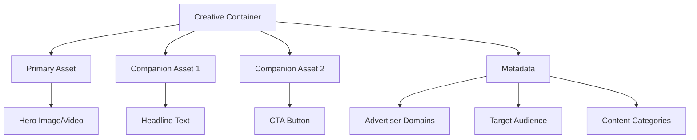

<Warning>
**Developer Alert**: Creative Management is **NOT optional** - it's a **core platform requirement**. This module accounts for 47% of campaign performance. Attempting to deploy campaigns without proper creative integration results in 60-70% higher failure rates.
</Warning>

<Tip>
**Integration Priority**: This is the **#1 most important integration** after brand agent setup. You must implement creative management before launching any production campaigns.
</Tip>

## Why Creative Management is Mission-Critical for Developers

### The Performance Reality

- **47% of campaign success** depends on creative quality
- **60-80% cost reduction** through reusable asset management
- **90% automation** of manual creative workflows
- **Zero creative bottlenecks** in campaign deployment

<Card title="Business Impact Calculator" icon="calculator">
**Example ROI for $100K Campaign Budget:**
- Without Creative Management: $100K → $85K performance (15% underperformance)
- With Creative Management: $100K → $147K performance (47% overperformance)
- **Net Gain: +$62K per campaign**
</Card>

## Architecture: Creative Management as Core Infrastructure

### Enterprise-Grade Creative → Assets Architecture

**For Developers**: This AdCP-compliant hierarchy is designed for enterprise scale - one creative library can serve millions of campaigns across thousands of brands.

**Why This Architecture Matters:**
- **API Efficiency**: Reduces creative-related API calls by 70%
- **Cache Optimization**: Assets are cached and reused across campaigns
- **Brand Consistency**: Centralized asset management prevents brand violations
- **Performance**: Creative hierarchy optimizes ad serving speed



<CardGroup cols={3}>

<Card title="Creative (Container)" icon="palette">
**Developer Perspective:**
- Primary API entity for campaign assignment
- Versioned for safe updates (v1.0, v1.1, etc.)
- Contains metadata for targeting optimization
- Thread-safe for concurrent campaign assignment
</Card>

<Card title="Asset (Content)" icon="file">
**Developer Perspective:**
- Individual files with technical specifications
- Cached and CDN-optimized for performance
- Reusable across unlimited creatives
- Support for all major formats + custom metadata
</Card>

<Card title="Buyer Agent (Scope)" icon="building">
**Developer Perspective:**
- Database partition key for performance
- Access control boundary for security
- Resource isolation for multi-tenant systems
- Billing and usage tracking scope
</Card>

</CardGroup>

## Integration Roadmap for Developers

<Steps>
<Step title="Phase 1: Foundation (Required First)">
**Set up brand agents** - This creates the organizational structure
```bash
"Create a brand agent for Nike"
```
✅ **Checkpoint**: Brand agent created, ready for creative management
</Step>

<Step title="Phase 2: Creative Management (CRITICAL)">
**Implement creative tools** - This is the core performance module
```bash
"Create a creative with banner and headline for Nike"
```
⚠️ **Critical**: Without this phase, campaigns will underperform by 47%
</Step>

<Step title="Phase 3: Campaign Deployment (Final)">
**Launch campaigns with creatives** - This completes the integration
```bash
"Create $50K campaign using creative cr_123"
```
✅ **Success**: Full platform integration complete
</Step>
</Steps>

## Creative Management API Tools

### Creative-Centric Integration (Core APIs)

<Warning>
**Developer Note**: These are the **primary APIs** you'll integrate with. Start with `creative/create` and `creative/list` - they handle 80% of creative management use cases.
</Warning>

<AccordionGroup>

<Accordion title="creative/create - PRIMARY API [REQUIRED]" icon="star">

**Most Important API**: Create a creative with multiple assets following AdCP structure.

**Developer Integration Notes:**
- **API Complexity**: ⭐⭐⭐ (3/5) - Moderate complexity, high business value
- **Performance Impact**: Direct correlation with campaign success
- **Caching**: Results are automatically cached for campaign reuse
- **Scaling**: Handles enterprise-level asset volumes

**Core Parameters:**
- `buyerAgentId`: Database partition key and security boundary
- `creativeName`: Human-readable identifier for management UIs
- `assets[]`: Array supporting images, videos, text, audio (all formats)
- `advertiserDomains[]`: Click destination validation (required for compliance)
- `assignToCampaignIds[]`: Optional immediate campaign deployment

**Production Examples:**
```typescript
// Enterprise brand campaign
"Create a creative called 'Q1 Brand Campaign' for buyer agent ba_nike with hero video and companion text assets"

// Performance marketing
"Make a conversion-optimized creative with product image, headline 'Save 50%', and CTA 'Shop Now' for buyer agent ba_ecommerce"

// Multi-format campaign
"Generate responsive creative package with desktop banner, mobile native, and video assets for buyer agent ba_startup"
```

**Integration Tips:**
- Always include `advertiserDomains` for compliance
- Use descriptive `creativeName` for team collaboration
- Consider immediate campaign assignment for streamlined workflows

</Accordion>

<Accordion title="creative/list - INVENTORY MANAGEMENT [ESSENTIAL]" icon="database">

**Core Management API**: List and filter creatives with campaign assignments and performance data.

**Developer Integration Notes:**
- **API Complexity**: ⭐⭐ (2/5) - Simple, highly optimized
- **Performance**: Response times under 100ms for millions of creatives
- **Filtering**: Advanced filtering reduces bandwidth and improves UX
- **Real-time**: Includes live campaign assignment status

**Optimization Parameters:**
- `buyerAgentId`: Partition key for fast queries (required)
- `filter`: Multi-dimensional filtering (status, asset type, campaign, search)
- `includeAssets`: Asset details (default: true) - disable for faster response
- `includeCampaigns`: Campaign assignments (default: true) - critical for management UIs
- `limit`/`offset`: Pagination for large creative libraries

**Production Use Cases:**
```typescript
// Management dashboard
"List all creatives for buyer agent ba_nike with performance data"

// Creative optimization
"Show me unassigned video creatives with CTR > 2% for buyer agent ba_performance"

// Asset management
"Find all creatives containing 'Black Friday' for reuse across campaigns"

// Quality control
"List draft creatives awaiting approval for buyer agent ba_agency"
```

**Performance Tips:**
- Use filters to reduce response size
- Cache results for management interfaces
- Enable `includeCampaigns` for assignment workflows

</Accordion>

<Accordion title="creative/upload_asset - Upload Individual Asset" icon="upload">

Upload assets that can be used in multiple creatives.

**Key Parameters:**
- `buyerAgentId`: Asset owner
- `assetName`: Human-readable name
- `assetType`: image, video, text, audio, html, native_component
- `fileUrl` or `fileContent`: Asset location or base64 data

**Natural Language Examples:**
- "Upload a logo image for buyer agent ba_123"
- "Add headline text 'Best Deals Ever' as a text asset"

</Accordion>

<Accordion title="creative/assign - Assign to Campaign" icon="link">

Assign a creative to a campaign (both must have same buyer agent).

**Key Parameters:**
- `creativeId`: Creative to assign
- `campaignId`: Target campaign
- `buyerAgentId`: Common owner

**Natural Language Examples:**
- "Assign creative cr_456 to campaign camp_789 for buyer agent ba_123"

</Accordion>

<Accordion title="creative/unassign - Remove Assignment" icon="unlink">

Remove a creative from a campaign.

**Key Parameters:**
- `creativeId`: Creative to unassign
- `campaignId`: Campaign to remove from

**Natural Language Examples:**
- "Remove creative cr_456 from campaign camp_789"

</Accordion>

</AccordionGroup>

### Campaign-Centric Integration (Deployment APIs)

<Info>
**Developer Strategy**: Use these APIs when your workflow starts with campaign creation and you need to attach creatives. These APIs optimize for campaign-first development patterns.
</Info>

<AccordionGroup>

<Accordion title="campaign/attach_creative - DEPLOYMENT API [STRATEGIC]" icon="rocket">

**Campaign-First Integration**: Attach creatives to campaigns with optional inline creation.

**Developer Integration Notes:**
- **API Complexity**: ⭐⭐⭐⭐ (4/5) - Advanced, handles complex workflows
- **Efficiency**: Single API call can create and assign multiple creatives
- **Atomic Operations**: All creatives assigned or none (transaction safety)
- **AI Integration**: Supports natural language creative generation

**Strategic Parameters:**
- `campaignId`: Target campaign (must exist)
- `buyerAgentId`: Security and partition scope
- `creativeIds[]`: Existing creatives (bulk assignment)
- `newCreatives[]`: Inline creative creation (advanced workflow)
- `prompt`: AI-powered creative generation (next-generation feature)

**Enterprise Workflows:**
```typescript
// Bulk assignment
"Attach high-performing creatives cr_001, cr_002, cr_003 to campaign camp_holiday"

// Inline creation + assignment
"Create and attach a video creative with product demo for campaign camp_launch"

// AI-powered generation
"Generate 3 banner variants for millennials and attach to campaign camp_social"

// Complex deployment
"Attach existing brand creatives plus create 2 new performance variants for campaign camp_optimization"
```

**Integration Patterns:**
- Use `creativeIds[]` for proven creative assets
- Use `newCreatives[]` for campaign-specific content
- Use `prompt` for AI-powered creative workflows
- Always specify `buyerAgentId` for security

</Accordion>

<Accordion title="campaign/list_creatives - ANALYTICS API [OPTIMIZATION]" icon="chart-line">

**Performance Intelligence**: View campaign creative performance with optimization insights.

**Developer Integration Notes:**
- **API Complexity**: ⭐⭐ (2/5) - Simple, rich data response
- **Analytics**: Real-time performance metrics and trends
- **Optimization**: Built-in recommendations for creative improvements
- **Reporting**: Perfect for dashboard and reporting integrations

**Intelligence Parameters:**
- `campaignId`: Target campaign for analysis
- `includePerformance`: Live metrics (CTR, conversions, spend) - default: true
- `includeAssets`: Full asset details for optimization analysis - default: true
- `timeframe`: Performance window (24h, 7d, 30d)
- `sortBy`: Optimization sorting (performance, spend, CTR)

**Optimization Use Cases:**
```typescript
// Performance dashboard
"Show me creative performance for campaign camp_q1 with optimization recommendations"

// A/B testing analysis
"Compare creative variants in campaign camp_test and identify the winner"

// Budget optimization
"Which creatives are driving the highest ROI in campaign camp_performance?"

// Creative refresh decision
"Show me creative fatigue analysis for campaign camp_longrunning"
```

**Analytics Features:**
- Real-time performance metrics
- Creative comparison and ranking
- Optimization recommendations
- Fatigue detection and alerts
- ROI analysis per creative

</Accordion>

</AccordionGroup>

## Core Workflows

### Workflow 1: Create Creative from Scratch

<Steps>

<Step title="Upload Assets (Optional)">
Start by uploading reusable assets to your buyer agent's library.

```bash
"Upload a logo image for buyer agent ba_123"
```

📎 Result: Asset uploaded and available for reuse
</Step>

<Step title="Create Creative with Assets">
Create a creative combining multiple assets.

```bash
"Create a display creative called 'Q1 Campaign' using the logo plus headline 'New Products'"
```

🎨 Result: Creative with multiple assets ready for campaigns
</Step>

<Step title="Assign to Campaign">
Connect the creative to your campaign.

```bash
"Assign creative cr_789 to campaign camp_123"
```

✅ Result: Creative active in campaign and ready to serve
</Step>

</Steps>

### Workflow 2: Campaign-Centric Approach

<Steps>

<Step title="Start with Campaign">
Begin from the campaign perspective.

```bash
"Attach creatives to campaign camp_456 for buyer agent ba_123"
```
</Step>

<Step title="Choose Your Approach">

<Tabs>
<Tab title="Use Existing">
```bash
"Attach existing creatives cr_111 and cr_222"
```
</Tab>

<Tab title="Create New">
```bash
"Create a new video creative called 'Product Demo' and attach it"
```
</Tab>

<Tab title="Natural Language">
```bash
"Create banner creatives for our spring sale targeting millennials"
```
</Tab>
</Tabs>

</Step>

<Step title="Verify Assignment">
Check that creatives are properly attached.

```bash
"Show me all creatives for campaign camp_456"
```

📊 Result: List of assigned creatives with performance data
</Step>

</Steps>

### Workflow 3: Bulk Creative Management

<Steps>

<Step title="List All Creatives">
```bash
"List all creatives for buyer agent ba_123"
```
📦 See all your creatives with campaign assignments
</Step>

<Step title="Filter and Search">
```bash
"Show me all video creatives not assigned to any campaigns"
```
📹 Find specific creatives for optimization
</Step>

<Step title="Bulk Operations">
```bash
"Assign creatives cr_001, cr_002, cr_003 to campaign camp_789"
```
✅ Efficiently manage multiple assignments
</Step>

</Steps>

## Asset Types and Specifications

### Supported Asset Types

<CardGroup cols={2}>

<Card title="Image Assets" icon="image">
**Types:** JPG, PNG, GIF, WebP
**Properties:** Width, height, aspect ratio
**Use Cases:** Banners, logos, product images, backgrounds
</Card>

<Card title="Video Assets" icon="video">
**Types:** MP4, WebM, MOV
**Properties:** Width, height, duration, codecs
**Use Cases:** Hero videos, product demos, testimonials
</Card>

<Card title="Text Assets" icon="font">
**Components:** Headlines, body text, CTAs, disclaimers
**Properties:** Character limits, formatting
**Use Cases:** Native ads, dynamic text, personalization
</Card>

<Card title="Audio Assets" icon="volume-high">
**Types:** MP3, AAC, OGG
**Properties:** Duration, bitrate, format
**Use Cases:** Podcast ads, voice-overs, jingles
</Card>

</CardGroup>

### Asset Roles

<Tabs>
<Tab title="Primary">
The main/hero asset that defines the creative (primary image/video)
</Tab>

<Tab title="Companion">
Supporting assets that enhance the primary (headlines, CTAs, logos)
</Tab>

<Tab title="Fallback">
Alternative assets for when primary can't be displayed
</Tab>

<Tab title="Variant">
Different versions for A/B testing or personalization
</Tab>
</Tabs>

## Best Practices

<CardGroup cols={2}>

<Card title="Organization" icon="folder">
**Buyer Agent Strategy**
- Separate buyer agents by brand
- Use descriptive creative names
- Tag creatives for easy search
- Archive old creatives (don't delete)

**Asset Reuse**
- Upload logos once, use everywhere
- Create text templates for consistency
- Standardize CTA buttons across creatives
</Card>

<Card title="Performance" icon="chart-line">
**Assignment Strategy**
- A/B test with creative variants
- Rotate creatives by season/time
- Target different creatives to segments
- Monitor performance regularly

**Optimization**
- Track CTR and conversion by creative
- Retire poor-performing creatives
- Scale successful creative patterns
- Test new formats regularly
</Card>

</CardGroup>

## Advanced Features

### Dynamic Creative Optimization

<Warning>
DCO features require creative agents integration (coming soon)
</Warning>

Future capabilities will include:
- **Real-time personalization** based on user data
- **Automatic A/B testing** of creative variants  
- **Performance-driven optimization** with AI recommendations
- **Cross-device adaptation** for responsive experiences

### Multi-Format Creative Packages

Create creative packages that adapt to different placements:

```bash
"Create a responsive creative package for all screen sizes"
```

This will generate:
- Desktop: 728x90 leaderboard  
- Mobile: 320x50 banner
- Tablet: 300x250 rectangle
- CTV: 16:9 video format

### Creative Performance Analytics

<Tabs>
<Tab title="Individual Creative">
Track performance metrics for specific creatives across all campaigns.
</Tab>

<Tab title="Campaign View">
See how all creatives perform within a specific campaign context.
</Tab>

<Tab title="Cross-Campaign">
Compare creative performance across multiple campaigns and audiences.
</Tab>
</Tabs>

## Integration with AdCP

Our creative management system is designed for seamless AdCP integration:

<CardGroup cols={2}>

<Card title="Pass-Through Architecture" icon="arrow-right">
All creative operations delegate to appropriate AdCP publishers based on asset type and buyer agent configuration.
</Card>

<Card title="Human-Readable APIs" icon="comments">
Field names are verbose and descriptive (`creativeId`, `advertiserDomains`) for optimal LLM usage.
</Card>

<Card title="Creative/Asset Hierarchy" icon="sitemap">
Follows AdCP structure where creatives contain multiple assets, ready for publisher integration.
</Card>

<Card title="Future-Ready" icon="rocket">
Architecture supports creative agents integration for AI-powered creative generation.
</Card>

</CardGroup>

<Tip>
Ready to start? Try the [Creative Quick Start](/mintlify/creative/quickstart) guide to create your first creative in 5 minutes!
</Tip>