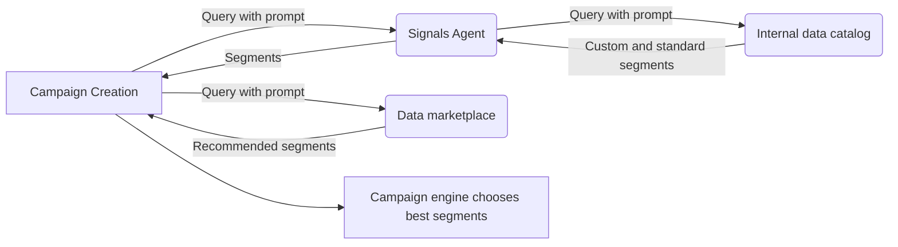

## Overview

Signals agents provide audience segments and targeting recommendations during campaign setup. When you create a campaign, we query registered signals agents to get relevant segments for your targeting criteria.

## How It Works



### The Process

1. **Campaign Setup**: You create a campaign with targeting criteria
2. **Agent Query**: We call your registered signals agent with campaign context
3. **Segment Response**: Agent returns relevant segments from your data
4. **Campaign Optimization**: Segments are added to campaign targeting

## Connecting Signals Agents

Scope3 works with various data platforms that provide signals agents:
- [Optable](https://www.optable.co)

For LiveRamp customers, we provide an open source signals agent to make data available to the platform. Please contact us for more information!

## Managing Signals Agents

### Register Agent

**MCP Tool**: `signals-agent/register`

Register a new signals agent for your seat:

```json
{
  "tool": "signals-agent/register",
  "parameters": {
    "name": "My Data Agent",
    "endpointUrl": "https://my-agent.example.com/adcp",
    "description": "Custom audience targeting using proprietary data"
  }
}
```

**Required Parameters:**
- `name` - Human-readable agent name
- `endpointUrl` - ADCP-compliant endpoint URL
- `description` - Agent description and capabilities

### List Agents

**MCP Tool**: `signals-agent/list`

View all registered signals agents:

```json
{
  "tool": "signals-agent/list",
  "parameters": {}
}
```

Returns agent details including status, registration date, and activity metrics.

### Get Agent Details

**MCP Tool**: `signals-agent/get`

Get detailed information about a specific agent:

```json
{
  "tool": "signals-agent/get", 
  "parameters": {
    "agentId": "agent_456"
  }
}
```

Returns complete agent configuration including:
- Agent ID, name, and description
- Endpoint URL and status
- Registration date and last activity
- Performance metrics and query counts
- Access permissions and authentication details

### Update Agent

**MCP Tool**: `signals-agent/update`

Modify agent configuration:

```json
{
  "tool": "signals-agent/update",
  "parameters": {
    "agentId": "agent_456",
    "name": "Updated Agent Name",
    "description": "Updated description"
  }
}
```

### Unregister Agent

**MCP Tool**: `signals-agent/unregister`

Remove an agent and revoke its access:

```json
{
  "tool": "signals-agent/unregister",
  "parameters": {
    "agentId": "agent_456"
  }
}
```

<Warning>
Unregistering an agent will revoke its API access and stop it from being queried during campaign creation.
</Warning>

## Building Signals Agents

For technical details on building signals agents, see the [ADCP documentation](https://adcontextprotocol.org/docs/signals/overview).

Once your agent is built and registered, you'll need to:

- [Create and manage segments](/partners/segment-management) via our APIs
- [Attach data to segments](/partners/data-attachment) through real-time APIs or CSV uploads