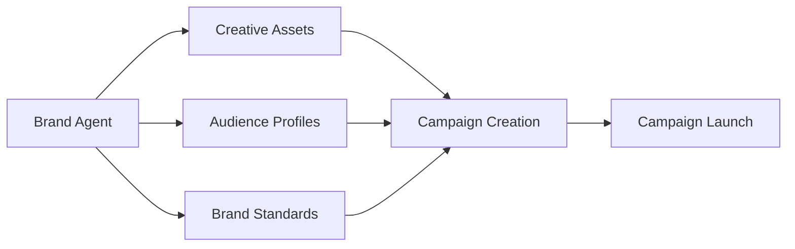
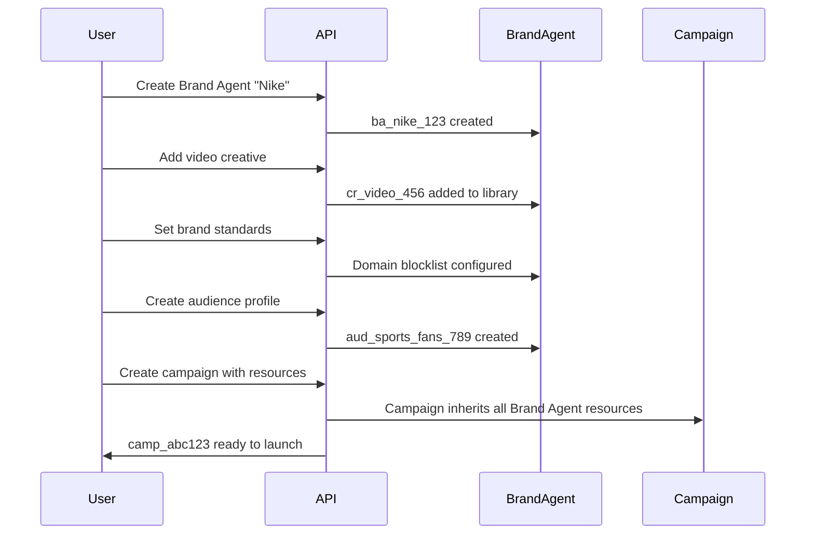

## Overview

**Campaigns** are the core execution layer of the Scope3 platform - where your advertising strategy comes to life through intelligent programmatic optimization. Every campaign exists within a **Brand Agent** (your advertiser account) and leverages shared resources like creatives, audiences, and brand standards.

<Warning>
**Campaign Dependency**: All campaigns must be created within a Brand Agent context. You cannot create standalone campaigns - they always belong to an advertiser account.
</Warning>

## Campaign Lifecycle

### Phase 1: Planning & Setup

Before launching any campaign, ensure you have:

1. **Brand Agent Created** - Your advertiser account foundation
2. **Creative Assets Ready** - High-quality creatives significantly impact performance  
3. **Audience Profiles (Optional)** - Brand story targeting profiles
4. **Brand Standards Configured (Optional)** - Domain filtering and brand safety rules



### Phase 2: Campaign Creation

<Tabs>
  <Tab title="Conversational Creation">
    ```
    User: "Create a $50,000 CTV campaign for Nike targeting sports fans aged 25-45"
    
    Claude: 🚀 Creating Nike campaign...
            
            ✅ Campaign created: camp_abc123
            📊 Budget: $50,000 USD
            🎯 Targeting: Sports enthusiasts, ages 25-45, CTV inventory
            📺 Strategy: AI-driven optimization
            🎨 Creatives: Auto-assigned from Nike brand agent library
            
            Status: Ready to launch
    ```
  </Tab>
  <Tab title="API Integration">
    ```json
    POST /campaigns
    {
      "brandAgentId": "ba_nike_123",
      "name": "Nike Summer Campaign 2024",
      "prompt": "Target sports enthusiasts aged 25-45 interested in athletic footwear, focus on CTV and premium video inventory during summer season",
      "budget": {
        "total": 50000,
        "currency": "USD"
      },
      "creativeIds": ["cr_nike_video_456", "cr_nike_display_789"],
      "audienceIds": ["aud_sports_fans_123"]
    }
    ```
  </Tab>
</Tabs>

### Phase 3: Launch & Optimization

Once launched, campaigns automatically begin the **AI optimization** process:

1. **Signal Discovery** - Algorithm identifies high-performing audience signals
2. **Brand Story Optimization** - AI-generated audience profiles are tested and refined
3. **Tactic Generation** - AI creates optimized targeting combinations
4. **Continuous Learning** - Performance data feeds back into optimization

### Phase 4: Monitoring & Management

<CardGroup cols={3}>
  <Card title="Performance Insights" href="/api-reference/reporting/get-campaign-summary" icon="chart-mixed">
    **Natural Language Analysis**
    
    "How's my campaign doing?" gets you instant insights with health scores, pacing status, and recommendations.
  </Card>
  
  <Card title="Data Export" href="/api-reference/reporting/export-campaign-data" icon="database">
    **Enterprise Analytics**
    
    Export structured data for BI systems with flexible grouping by tactic, signal, brand story, and publisher.
  </Card>
  
  <Card title="ML Analytics" href="/api-reference/reporting/analyze-tactics" icon="microscope">
    **Advanced Optimization**
    
    Deep statistical analysis of tactic performance with actionable optimization recommendations. [See Tactic Guide](/object-guides/tactic) for detailed analysis.
  </Card>
</CardGroup>

## Key Campaign Features

### 🎯 AI-Driven Optimization Strategy

All campaigns use Scope3's intelligent optimization approach:

- **Premium Inventory Focus**: Curated, high-quality ad placements
- **AI-Driven Optimization**: Machine learning optimizes targeting in real-time
- **Quality-First**: Brand-safe, viewable, fraud-free impressions
- **Performance Optimization**: Continuous learning and adjustment

### 🔗 Resource Integration

Campaigns seamlessly integrate with other Brand Agent resources:

<Tabs>
  <Tab title="Creative Integration">
    **Shared Creative Library**
    
    - Creatives belong to the Brand Agent, not individual campaigns
    - Multiple campaigns can use the same creative assets
    - Creative performance tracked across all campaigns
    - Easy creative swapping and A/B testing
    
    ```javascript
    // Assign creatives during campaign creation
    const campaign = await createCampaign({
      brandAgentId: "ba_123",
      name: "Summer Sale Campaign",
      creativeIds: ["cr_video_456", "cr_display_789"]
    });
    
    // Update creative assignments
    await updateCampaign({
      campaignId: "camp_123",
      creativeIds: ["cr_new_video_999"] // Replaces existing assignments
    });
    ```
  </Tab>
  
  <Tab title="Audience Targeting">
    **Brand Story Profiles**
    
    - Pre-built audience segments for precise targeting
    - Reusable across multiple campaigns
    - AI-powered audience expansion and lookalike modeling
    - Performance tracking by audience segment
    
    ```javascript
    // Use existing audience profiles
    const campaign = await createCampaign({
      brandAgentId: "ba_123",
      name: "Targeted Campaign",
      audienceIds: ["aud_sports_fans_123", "aud_luxury_shoppers_456"]
    });
    ```
  </Tab>
  
  <Tab title="Brand Safety">
    **Inherited Brand Standards**
    
    - All campaigns automatically inherit Brand Agent safety rules
    - Domain blocklists and allowlists
    - Keyword filtering
    - Content category restrictions
    - No per-campaign configuration needed
    
    ```javascript
    // Brand standards automatically applied
    const brandStandards = await setBrandStandards({
      brandAgentId: "ba_123",
      domainBlocklist: ["competitor.com", "inappropriate-site.com"],
      keywordFilters: ["controversial-topic"]
    });
    // All campaigns for ba_123 now inherit these rules
    ```
  </Tab>
</Tabs>

### 📊 Advanced Analytics & Insights

Every campaign generates rich performance data for optimization:

#### Performance Analysis
For detailed tactic performance analysis including signal effectiveness and brand story optimization, see the [Tactic Guide](/object-guides/tactic) and [Signal Guide](/object-guides/signal).

**Key Analysis Types Available:**
- **Signal Performance**: Track audience targeting effectiveness
- **Brand Story Optimization**: Understand which AI-generated audiences perform best  
- **Efficiency Analysis**: Compare tactic cost-effectiveness
- **Attribution Analysis**: Understand conversion path contributions

#### Real-time Delivery Monitoring
Get instant visibility into campaign pacing and performance:

```javascript
const summary = await getCampaignSummary({
  campaignId: "camp_123"
});

// Returns human-readable summary:
// 🎯 Campaign Health Score: 85/100
// 📊 Pacing: On track (52% budget, 48% flight remaining)
// 💰 Performance: $2.34 CPM, strong completion rates
// 🔧 Recommendation: Increase budget for high performers
```

### ⚖️ Scoring Configuration

**Control how tactics are evaluated and optimized with three-component scoring.**

Campaigns use a weighted formula combining Quality, Outcome, and Story Affinity scores to determine budget allocation. You configure the weights and outcome measurement timing.

<Tabs>
  <Tab title="Performance-Focused Setup">
    **Optimize for conversions and outcomes**
    
    ```javascript
    const campaign = await createCampaign({
      brandAgentId: "ba_123",
      name: "Q4 Performance Campaign",
      prompt: "Target high-intent customers for holiday conversions",
      
      // Weight outcome scores heavily
      scoringWeights: {
        quality: 0.2,       // 20% media quality
        outcome: 0.7,       // 70% your conversion data
        affinity: 0.1       // 10% brand story alignment
      },
      
      // Attribution data arrives in 7 days
      outcomeScoreWindowDays: 7,
      
      budget: { total: 100000, currency: "USD" }
    });
    ```
  </Tab>
  
  <Tab title="Brand-Safe Premium Setup">
    **Prioritize quality inventory and brand alignment**
    
    ```javascript
    const campaign = await createCampaign({
      brandAgentId: "ba_456",
      name: "Luxury Brand Campaign",
      prompt: "Associate with premium content and high-quality placements",
      
      // Emphasize quality and brand story alignment
      scoringWeights: {
        quality: 0.5,       // 50% media quality (premium inventory)
        outcome: 0.2,       // 20% outcome measurement
        affinity: 0.3       // 30% brand story alignment
      },
      
      // Brand lift studies take longer
      outcomeScoreWindowDays: 30,
      
      budget: { total: 75000, currency: "USD" }
    });
    ```
  </Tab>
  
  <Tab title="Audience Testing Setup">
    **Test brand story effectiveness**
    
    ```javascript
    const campaign = await createCampaign({
      brandAgentId: "ba_789",
      name: "Audience Discovery Campaign",
      prompt: "Test different audience segments against brand stories",
      
      // Emphasize story affinity for learning
      scoringWeights: {
        quality: 0.2,       // 20% media quality
        outcome: 0.3,       // 30% outcome measurement
        affinity: 0.5       // 50% brand story alignment
      },
      
      // Real-time engagement data
      outcomeScoreWindowDays: 1,
      
      budget: { total: 50000, currency: "USD" }
    });
    ```
  </Tab>
</Tabs>

#### The Three Scoring Components

**Quality Score** (Scope3-provided)
- Impression quality, viewability, completion rates
- IVT detection and brand safety metrics
- Scale: 0-100 (100 = premium media quality)

**Outcome Score** (You provide)
- Your normalized measurement data (ROAS, conversions, brand lift)  
- Scale: 0-1000 (100 = meets target, 1000 = 10x target)
- You define what the numbers mean

**Story Affinity Score** (Scope3-provided)
- How well tactics align with your selected brand stories
- Uses the brand stories you created and assigned
- Scale: 0-100 (100 = perfect story alignment)

<Note>
**Weights must sum to 1.0** and determine how much each component influences budget allocation. See the [Scoring Guide](/optimization/scoring) for detailed explanation and weight strategy examples.
</Note>

#### Outcome Score Window Days

**Critical for RL algorithm performance.** Specify how many days before your outcome measurement data arrives:

- **Immediate data**: 0-1 days (engagement, clicks)
- **Attribution data**: 1-7 days (conversions, CRM matching) 
- **Brand studies**: 7-30 days (lift measurement)
- **MMM data**: 30+ days (incrementality studies)

Without proper window configuration, tactics get incorrectly penalized before your measurement data arrives.

## Campaign Workflow Examples

### Complete Campaign Setup



### Multi-Campaign Resource Sharing

```javascript
// Step 1: Create Brand Agent with shared resources
const brandAgent = await createBrandAgent({
  name: "Nike Global",
  description: "Nike's global advertising account"
});

// Step 2: Build shared creative library
const videoCreative = await createCreative({
  brandAgentId: brandAgent.id,
  name: "Nike Performance Video",
  type: "video",
  url: "https://cdn.nike.com/performance.mp4"
});

const displayCreative = await createCreative({
  brandAgentId: brandAgent.id,
  name: "Nike Performance Display",
  type: "image", 
  url: "https://cdn.nike.com/performance.jpg"
});

// Step 3: Create audience profiles
const sportsAudience = await createAudience({
  brandAgentId: brandAgent.id,
  name: "Sports Enthusiasts",
  description: "Active lifestyle, aged 25-45"
});

// Step 4: Launch multiple campaigns using shared resources
const summerCampaign = await createCampaign({
  brandAgentId: brandAgent.id,
  name: "Nike Summer Campaign",
  budget: { total: 50000, currency: "USD" },
  creativeIds: [videoCreative.id, displayCreative.id],
  audienceIds: [sportsAudience.id]
});

const backToSchoolCampaign = await createCampaign({
  brandAgentId: brandAgent.id,
  name: "Nike Back to School Campaign", 
  budget: { total: 30000, currency: "USD" },
  creativeIds: [displayCreative.id], // Reusing creative
  audienceIds: [sportsAudience.id]   // Reusing audience
});
```

## Performance Optimization Best Practices

### 1. Creative Quality First
- **High-quality creatives** are the single biggest factor in campaign performance
- Use multiple creative formats (video, display, native) for broader reach
- Test different creative messages and CTAs
- Monitor creative performance across campaigns

### 2. Budget Sizing
- **Minimum viable**: $1,000 for basic campaigns
- **Recommended minimum**: $10,000 for meaningful optimization
- **Enterprise scale**: $100,000+ for advanced ML optimization
- Higher budgets enable more sophisticated targeting and learning

### 3. Targeting Strategy
- Start broad, let AI find optimal segments
- Use natural language descriptions in campaign prompts
- Leverage brand stories for precise targeting
- Monitor signal performance and adjust accordingly

### 4. Monitoring & Optimization
- Check campaign health weekly with `get_campaign_summary`
- Export data for deeper analysis with `export_campaign_data`
- Use [tactic performance insights](/object-guides/tactic) for optimization decisions
- Set up real-time alerts for performance issues

## Common Campaign Patterns

### A/B Testing Campaigns

```javascript
// Create two campaigns with different targeting approaches
const campaignA = await createCampaign({
  brandAgentId: "ba_123",
  name: "Test A: Broad Targeting",
  prompt: "Target general sports interests, broad age range",
  budget: { total: 25000, currency: "USD" },
  creativeIds: ["cr_video_123"]
});

const campaignB = await createCampaign({
  brandAgentId: "ba_123", 
  name: "Test B: Narrow Targeting",
  prompt: "Target premium athletic footwear enthusiasts aged 25-35",
  budget: { total: 25000, currency: "USD" },
  creativeIds: ["cr_video_123"] // Same creative for fair comparison
});

// Compare performance after sufficient data collection
// Compare campaign performance using tactic analysis
// See Tactic Guide for detailed analysis examples
```

### Seasonal Campaign Management

```javascript
// Create seasonal campaigns that share core resources
const holidayCampaign = await createCampaign({
  brandAgentId: "ba_nike_123",
  name: "Nike Holiday 2024",
  prompt: "Target holiday shoppers looking for athletic gifts, premium inventory focus",
  budget: { total: 100000, currency: "USD" },
  creativeIds: ["cr_holiday_video", "cr_holiday_display"],
  audienceIds: ["aud_gift_shoppers", "aud_premium_customers"]
});

const backToSchoolCampaign = await createCampaign({
  brandAgentId: "ba_nike_123",
  name: "Nike Back to School 2024", 
  prompt: "Target students and parents preparing for school year, value-focused messaging",
  budget: { total: 75000, currency: "USD" },
  creativeIds: ["cr_bts_video", "cr_value_display"],
  audienceIds: ["aud_students", "aud_parents"]
});
```

## Integration with External Systems

### BI/Analytics Integration

```javascript
// Export campaign data for external analysis
const exportData = await exportCampaignData({
  brandAgentId: "ba_123",
  dateRange: { 
    start: "2024-01-01", 
    end: "2024-01-31" 
  },
  datasets: ["delivery", "events", "tactics"],
  groupBy: ["date", "campaign", "tactic", "signal"],
  format: "parquet", // Optimized for analytics
  compression: "gzip"
});

// Use exported data in your BI pipeline
// Supports: JSON, CSV, Parquet formats
// Integrates with: Snowflake, BigQuery, Databricks, etc.
```

### Real-time Notifications

While campaign tools provide on-demand insights, set up real-time notifications through the **Scope3 Dashboard**:

1. **Log into [app.scope3.com](https://app.scope3.com)**
2. **Navigate to Campaign Settings → Notifications**
3. **Configure alert destinations:**
   - Slack channels for team notifications
   - Email addresses for key stakeholders
   - Webhook URLs for custom integrations

**Alert types include:**
- Budget pacing issues (over/under delivery)
- Performance anomalies (significant CPM changes)
- Campaign status changes (paused, completed)
- Creative performance alerts (poor completion rates)

## Campaign API Reference

<CardGroup cols={3}>
  <Card title="create_campaign" href="http://localhost:3000/api-reference/campaigns/create-campaign" icon="plus">
    **Create New Campaigns**
    
    Launch campaigns with intelligent targeting, creative assignment, and budget management.
  </Card>
  
  <Card title="update_campaign" href="http://localhost:3000/api-reference/campaigns/update-campaign" icon="pencil">
    **Update Campaigns**
    
    Modify budgets, swap creatives, adjust targeting, and manage campaign status.
  </Card>
  
  <Card title="list_campaigns" href="http://localhost:3000/api-reference/campaigns/list-campaigns" icon="list">
    **List Campaigns**
    
    Retrieve all campaigns for a brand agent with filtering and performance data.
  </Card>
</CardGroup>

## Next Steps

<CardGroup cols={2}>
  <Card title="Reporting Guide" href="/reporting-overview" icon="chart-line">
    **Campaign Analytics & Optimization**
    
    Comprehensive guide to campaign reporting, performance analysis, and optimization strategies.
  </Card>
  
  <Card title="Creative Integration" href="/mintlify/creative/overview" icon="palette">
    **Maximize Campaign Performance**
    
    Learn how to leverage the creative management system for maximum campaign impact. Creative quality is the #1 factor in campaign success.
  </Card>
</CardGroup>