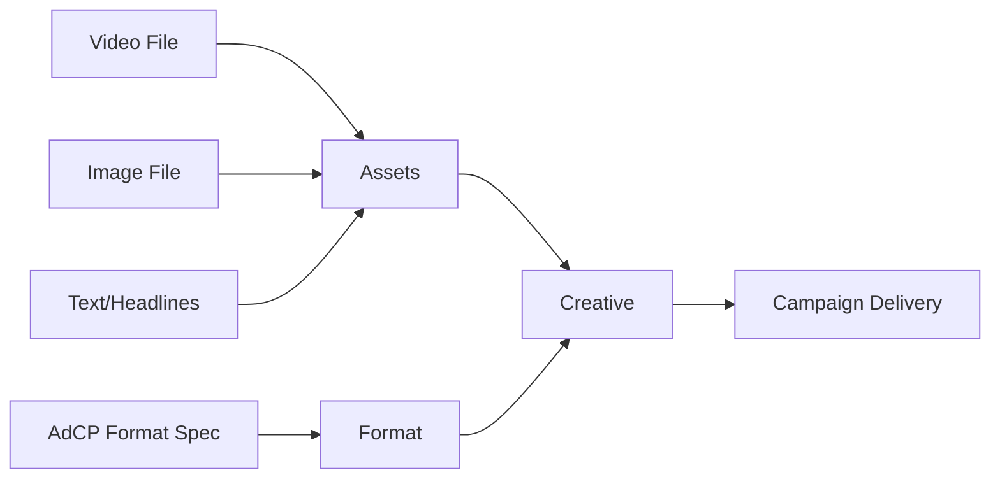
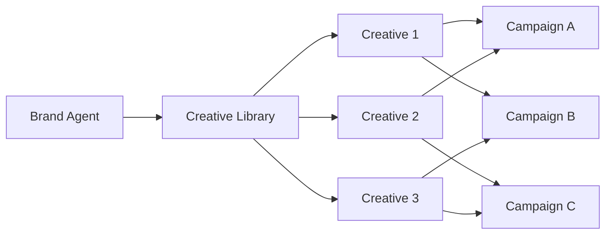

## Overview

**Creatives** are the actual ad content that users see - the videos, images, text, and interactive experiences that bring your brand message to life. In the Scope3 platform, creatives are created and stored at the **Brand Agent** level (the advertiser's account), then referenced by multiple campaigns as needed.

<Warning>
**Important Architecture**: Creatives belong to Brand Agents, NOT to campaigns. You first create creatives in the brand agent's library, then campaigns reference those creatives. This enables reuse across multiple campaigns.
</Warning>

## Creative Architecture

### How Creatives Work

Creatives implement specific formats using assets:



**Key Concepts**:
- **Assets** - The actual media files (images, videos, text) you provide
- **Format** - The AdCP specification that defines requirements
- **Creative** - Implements a specific format using your assets
- **Delivery** - Creative is delivered to campaigns that need that format

### Asset Requirements

<Warning>
**Important**: Creative assets must be accessible via public URLs. You can either host them on your own CDN or use our MCP asset upload tools for automatic hosting.
</Warning>

**Two Asset Hosting Options**:

<Tabs>
  <Tab title="Your CDN">
    **Host assets on your infrastructure**
    
    ```json
    {
      "creative": {
        "url": "https://cdn.yourbrand.com/video.mp4",
        "headline": "Your Product", 
        "cta": "Learn More"
      }
    }
    ```
    
    **Requirements**: Assets must be publicly accessible with HTTPS URLs
  </Tab>
  
  <Tab title="MCP Asset Upload">
    **Use our MCP tools for automated hosting**
    
    ```javascript
    // 1. Upload assets via MCP tools
    const upload = await client.callTool({
      name: "assets_upload",
      arguments: {
        assets: [{
          assetType: "video",
          base64Data: videoBase64, // No data URI prefix
          contentType: "video/mp4",
          filename: "product-demo.mp4",
          metadata: { buyerAgentId: "ba_123" }
        }]
      }
    });
    
    // 2. Use returned public URL in creative
    const creative = await createCreative({
      brandAgentId: "ba_123",
      name: "Product Demo",
      url: upload.assets[0].publicUrl, // Auto-generated public URL
      formatId: "adcp_ctv_standard_30s"
    });
    ```
    
    **Benefits**: 
    - Automatic file validation and size checking
    - Hierarchical organization by brand agent
    - Built-in CDN distribution
    - **File Size Limits**: Image (10MB), Video (100MB), Audio (50MB), Logo (5MB), Font (2MB)
  </Tab>
</Tabs>

## Core Creative Concepts

### 1. Creative Types

<CardGroup cols={2}>
  <Card title="🎬 Video" icon="video">
    **Connected TV & Online Video**
    - 15s, 30s, 60s formats
    - VAST/VPAID compatible
    - Adaptive bitrate streaming
    - Captions and overlays
  </Card>
  
  <Card title="🖼️ Display" icon="image">
    **Banner & Rich Media**
    - Standard IAB sizes
    - Responsive layouts
    - Retina-ready graphics
    - HTML5 animations
  </Card>
  
  <Card title="📝 Native" icon="newspaper">
    **In-Feed & Content**
    - Headline + description
    - Sponsored content format
    - Platform-native styling
    - Multiple image ratios
  </Card>
  
  <Card title="🎮 Interactive" icon="gamepad">
    **HTML5 & Playables**
    - Rich interactive experiences
    - Game demos
    - Product configurators
    - AR/VR experiences
  </Card>
</CardGroup>

### 2. Creative Formats

Creatives implement specific formats defined by publishers and standards bodies. Each creative targets one format.

<Card title="📖 Learn About Creative Formats" href="/mintlify/object-guides/format" icon="shapes">
  Understand how AdCP formats work and how creatives implement them
</Card>

### 3. Creative Assignment Pattern

Creatives follow a **create-once, use-many** pattern:



**Benefits**:
- **Efficiency**: Upload once, use everywhere
- **Consistency**: Same creative across campaigns
- **Performance Tracking**: See which creatives work best
- **A/B Testing**: Easy creative rotation

## Creative Lifecycle

### Creative Creation Approaches

Choose from three approaches to create creatives:

<Tabs>
  <Tab title="3rd Party Ad Server">
    **Use existing ad server tags (e.g., Google CM360, Flashtalking)**
    
    We take your ad server code and wrap it in a creative - it's a single step:
    
    ```javascript
    const creative = await createCreative({
      brandAgentId: "ba_123",
      name: "Campaign Creative",
      formatId: "adcp_display_300x250",
      adServerTag: "https://ad.doubleclick.net/ddm/trackclk/..."
    });
    ```
    
    **Best for**: Teams with existing ad server relationships
    **How it works**: Your ad server tag is passed through directly to publishers
  </Tab>
  
  <Tab title="Native">
    **Provide assets for publisher assembly**
    
    We send your assets onward to the publisher for assembly:
    
    ```javascript
    const creative = await createCreative({
      brandAgentId: "ba_123",
      name: "Hero Video",
      formatId: "adcp_ctv_standard_30s",
      url: "https://cdn.yourbrand.com/video-30s.mp4",
      headline: "Your Product",
      cta: "Learn More"
    });
    ```
    
    **Best for**: Direct control over asset hosting and delivery
    **How it works**: Assets are delivered to publishers who handle final assembly
  </Tab>
  
  <Tab title="Creative Agent">
    **Use AI-powered creative generation**
    
    Provide a brief and optional assets/audiences to the agent:
    
    ```javascript
    const creative = await generateCreative({
      brandAgentId: "ba_123",
      brief: "Create a 30s video showcasing our new product",
      formatId: "adcp_ctv_standard_30s",
      assets: ["logo.png", "product-shots.mp4"],  // Optional
      audienceIds: ["aud_tech_enthusiasts"]       // Optional brand stories
    });
    ```
    
    **Best for**: Rapid creative generation and testing
    **How it works**: AI generates creative based on brief, brand assets, and audience insights
    
    <Card title="🤖 Learn About Creative Agents" href="/mintlify/integrations/creative-agents" icon="robot">
      Explore AI-powered creative generation
    </Card>
  </Tab>
</Tabs>

### Campaign Assignment

Creatives are assigned to campaigns during creation or via updates:

```javascript
// Option 1: Assign during campaign creation
const campaign = await createCampaign({
  brandAgentId: "ba_nike_123",
  name: "Summer Sale Campaign",
  creativeIds: ["cr_video_456", "cr_display_789"], // Assign creatives
  budget: { total: 50000, currency: "USD" }
});

// Option 2: Update existing campaign
const updated = await updateCampaign({
  campaignId: "camp_abc123",
  creativeIds: ["cr_video_456", "cr_native_012"] // Replace creatives
});
```

### Step 4: Performance Optimization

The platform automatically optimizes creative delivery based on performance:

<CardGroup cols={2}>
  <Card title="📊 Creative Rotation" icon="rotate">
    **Automatic A/B Testing**
    - Even rotation initially
    - Performance-based weighting
    - Winner emergence over time
    - Statistical significance testing
  </Card>
  
  <Card title="🎯 Contextual Matching" icon="bullseye">
    **Right Creative, Right Context**
    - Sports content → Athletic creatives
    - News sites → Native formats
    - Entertainment → Video focus
    - Shopping → Product displays
  </Card>
  
  <Card title="⚡ Dynamic Optimization" icon="bolt">
    **Real-Time Adjustments**
    - Dayparting optimization
    - Device-specific selection
    - Audience resonance
    - Fatigue management
  </Card>
  
  <Card title="🔄 Format Adaptation" icon="sync">
    **Cross-Platform Delivery**
    - Automatic format conversion
    - Resolution optimization
    - Bandwidth adaptation
    - Platform compliance
  </Card>
</CardGroup>

## Creative Best Practices

### Quality Guidelines

<AccordionGroup>
  <Accordion title="🎬 Video Creatives">
    **Technical Requirements**
    - Resolution: 1920x1080 minimum (4K preferred)
    - Frame rate: 24-30 fps standard
    - Bitrate: 10+ Mbps for HD
    - Audio: 128 kbps minimum stereo
    
    **Content Guidelines**
    - Hook within first 3 seconds
    - Clear brand identification
    - Captions for sound-off viewing
    - Strong CTA in final frame
    - Multiple duration versions (15s, 30s)
  </Accordion>
  
  <Accordion title="🖼️ Display Creatives">
    **Design Standards**
    - High contrast for readability
    - Mobile-first responsive design
    - Retina-ready graphics (2x resolution)
    - File size under 200KB for display
    
    **Format Coverage**
    - 300x250 (Medium Rectangle)
    - 728x90 (Leaderboard)
    - 160x600 (Wide Skyscraper)
    - 320x50 (Mobile Banner)
    - 300x600 (Half Page)
  </Accordion>
  
  <Accordion title="📝 Native Creatives">
    **Content Strategy**
    - Value-first messaging
    - Editorial-style writing
    - Authentic imagery
    - Subtle brand integration
    
    **Text Optimization**
    - Headline: 25-40 characters
    - Description: 75-90 characters
    - Clear value proposition
    - Action-oriented CTAs
  </Accordion>
</AccordionGroup>

## API Mapping

### Core Creative Operations

<CardGroup cols={2}>
  <Card title="Create Creative" href="/api-reference/creative/create" icon="plus">
    `POST /creatives` - Add new creative to brand agent library
  </Card>
  
  <Card title="List Creatives" href="/api-reference/creative/list" icon="list">
    `GET /creatives` - View all creatives for a brand agent
  </Card>
  
  <Card title="Update Creative" href="/api-reference/creative/update" icon="edit">
    `PUT /creatives/{id}` - Modify creative properties
  </Card>
  
  <Card title="Assign to Campaign" href="/api-reference/campaign/update" icon="link">
    `PUT /campaigns/{id}` - Assign creatives via campaign update
  </Card>
</CardGroup>

### Advanced Creative Tools

<CardGroup cols={2}>
  <Card title="Format Discovery" href="/api-reference/format/list" icon="shapes">
    `list_creative_formats` - Discover available formats and specs via MCP
  </Card>
  
  <Card title="Asset Upload" href="/api-reference/assets_upload" icon="upload">
    `assets_upload` - Upload creative assets to GCS with validation via MCP
  </Card>
  
  <Card title="Asset Management" href="/api-reference/assets_add" icon="folder">
    `assets_add` - Add assets to brand agent library via MCP
  </Card>
  
  <Card title="Publisher Sync" href="/api-reference/creative/sync-publishers" icon="sync">
    `sync_creative_to_publishers` - Sync creatives to publisher platforms via MCP
  </Card>
  
  <Card title="Approval Status" href="/api-reference/creative_approval_status" icon="check">
    `get_creative_approval_status` - Check publisher approval status via MCP
  </Card>
  
  <Card title="Asset Analytics" href="/api-reference/assets_analytics" icon="chart-line">
    `assets_analytics` - View upload statistics and storage insights via MCP
  </Card>
</CardGroup>

## Common Patterns

### Multi-Format Campaign Launch with MCP Asset Upload

```javascript
// 1. Upload assets via MCP tools first
const assetUpload = await client.callTool({
  name: "assets_upload",
  arguments: {
    assets: [
      {
        assetType: "video",
        base64Data: videoBase64Data, // 30s hero video
        contentType: "video/mp4",
        filename: "hero-30s.mp4",
        metadata: { buyerAgentId: "ba_brand_123", tags: ["hero", "ctv"] }
      },
      {
        assetType: "image", 
        base64Data: bannerBase64Data, // Display banner
        contentType: "image/jpeg",
        filename: "banner-300x250.jpg",
        metadata: { buyerAgentId: "ba_brand_123", tags: ["banner", "display"] }
      },
      {
        assetType: "image",
        base64Data: nativeBase64Data, // Native hero image
        contentType: "image/jpeg", 
        filename: "native-hero.jpg",
        metadata: { buyerAgentId: "ba_brand_123", tags: ["native", "content"] }
      }
    ]
  }
});

// 2. Create creatives using uploaded asset URLs
const videoCreative = await createCreative({
  brandAgentId: "ba_brand_123",
  name: "Hero Video - 30s",
  type: "video",
  url: assetUpload.assets[0].publicUrl // Auto-generated GCS URL
});

const displayCreative = await createCreative({
  brandAgentId: "ba_brand_123", 
  name: "Product Banner Set",
  type: "image",
  url: assetUpload.assets[1].publicUrl
});

const nativeCreative = await createCreative({
  brandAgentId: "ba_brand_123",
  name: "Sponsored Story", 
  type: "native",
  headline: "Discover Our Latest Innovation",
  body: "Learn how our products can transform...",
  url: assetUpload.assets[2].publicUrl
});

// 3. Launch campaign with all creatives
const campaign = await createCampaign({
  brandAgentId: "ba_brand_123",
  name: "Q4 Integrated Campaign",
  creativeIds: [
    videoCreative.id,
    displayCreative.id, 
    nativeCreative.id
  ],
  budget: { total: 100000, currency: "USD" }
});
```

### Creative Performance Analysis

```javascript
// Get campaign summary with creative breakdown
const summary = await getCampaignSummary({
  campaignId: "camp_abc123",
  includeCreativePerformance: true
});

// Analyze which creatives drive performance
summary.creativePerformance.forEach(creative => {
  console.log(`${creative.name}:
    - Impressions: ${creative.impressions}
    - CTR: ${creative.ctr}%
    - Conversions: ${creative.conversions}
    - Efficiency Score: ${creative.efficiencyScore}/100
  `);
});

// Optimize based on performance
const topPerformers = summary.creativePerformance
  .filter(c => c.efficiencyScore > 80)
  .map(c => c.id);

await updateCampaign({
  campaignId: "camp_abc123",
  creativeIds: topPerformers // Focus on winners
});
```

## Troubleshooting

<AccordionGroup>
  <Accordion title="❌ Creative Not Delivering">
    **Common Causes**:
    - Creative not approved by publishers
    - Asset URLs not accessible (403/404 errors)
    - Format incompatible with inventory
    - File size exceeds limits
    
    **Solution**: Check approval status and validate asset URLs
  </Accordion>
  
  <Accordion title="⚠️ Poor Performance">
    **Diagnostic Steps**:
    1. Check creative age (fatigue after 4-6 weeks)
    2. Verify audience-creative match
    3. Review competitive landscape
    4. Test new variations
    
    **Quick Fix**: Refresh creative assets and test new messages
  </Accordion>
  
  <Accordion title="🔄 Sync Issues">
    **Publisher Sync Problems**:
    - Spec mismatches
    - Missing required fields
    - Approval delays
    
    **Resolution**: Use format discovery API to ensure compliance
  </Accordion>
</AccordionGroup>

## Next Steps

<CardGroup cols={3}>
  <Card title="🚀 Quick Start" href="../quickstart" icon="rocket">
    Create your first creative in the main quickstart guide
  </Card>
  
  <Card title="🤖 AI Agents" href="/mintlify/integrations/creative-agents" icon="robot">
    Leverage AI for creative generation
  </Card>
  
  <Card title="📊 Performance" href="/mintlify/reporting-overview" icon="chart-line">
    Analyze creative effectiveness
  </Card>
</CardGroup>

<Tip>
**Pro Tip**: Start with 3-5 creative variations to enable meaningful A/B testing. The platform's ML optimization works best with multiple options to choose from.
</Tip>