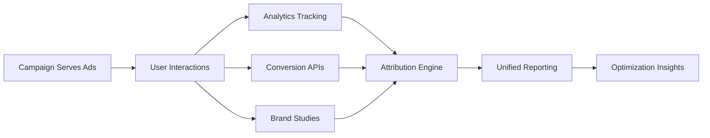

## Overview

**Measurement Sources** are analytics integrations and data connections that provide campaign performance tracking, attribution data, and conversion measurement. They enable comprehensive campaign analysis by connecting first-party data, third-party analytics, and conversion tracking systems.

<Note>
**Data Integration**: Measurement sources connect your existing analytics tools and data sources to provide unified campaign performance reporting.
</Note>

## Types of Measurement Sources

### Analytics Platforms

**Google Analytics**
- Website conversion tracking and attribution
- Audience behavior analysis and segmentation  
- E-commerce transaction data and revenue attribution
- Custom event tracking and goal completion metrics

**Adobe Analytics**
- Advanced segmentation and customer journey analysis
- Multi-touch attribution modeling and path analysis
- Real-time data processing and custom reporting
- Integration with Adobe Marketing Cloud suite

### Brand Study Platforms

**Brand Lift Studies**
- Awareness, consideration, and intent measurement
- Control vs. exposed audience comparison
- Survey-based brand perception tracking
- Statistical significance testing and confidence intervals

**Custom Research Platforms**
- Third-party research integration (Nielsen, Kantar, Ipsos)
- Survey panel data and consumer insights
- Brand tracking study integration
- Market research data correlation

### Conversion APIs

**Facebook Conversions API**
- Server-side conversion event tracking
- Cross-device attribution and deduplication
- Custom audience creation from conversion data
- Privacy-compliant data sharing

**Google Enhanced Conversions**
- First-party data enhancement for attribution
- Improved conversion tracking accuracy
- Cross-device and cross-platform measurement
- Privacy-safe conversion optimization

### MMM (Marketing Mix Modeling)

**Statistical Modeling Platforms**
- Marketing mix modeling integration
- Media contribution analysis and ROI measurement
- Incrementality testing and base vs. lift analysis
- Budget optimization recommendations

## Adding Measurement Sources

### Analytics Integration

```javascript
const analyticsSource = await addMeasurementSource({
  brandAgentId: "ba_123",
  name: "Google Analytics 4",
  type: "analytics",
  configuration: {
    platform: "google_analytics",
    propertyId: "GA_PROPERTY_123456789",
    apiKey: process.env.GA4_API_KEY,
    trackingEvents: [
      "purchase",
      "add_to_cart", 
      "begin_checkout",
      "page_view",
      "custom_conversion"
    ],
    conversionWindows: {
      view: 30, // days
      click: 7   // days
    },
    attributionModel: "data_driven"
  }
});
```

### Brand Study Setup

```javascript
const brandStudy = await addMeasurementSource({
  brandAgentId: "ba_123", 
  name: "Q1 Brand Lift Study",
  type: "brand_study",
  configuration: {
    provider: "nielsen_dar",
    studyId: "study_2024_q1_brand_lift",
    metrics: [
      "unaided_awareness",
      "aided_awareness", 
      "purchase_intent",
      "brand_favorability"
    ],
    methodology: {
      controlGroupSize: 10000,
      testGroupSize: 50000,
      surveyFrequency: "weekly",
      confidenceLevel: 0.95
    },
    timeline: {
      baselineStart: "2024-01-01",
      campaignStart: "2024-01-15", 
      studyEnd: "2024-03-31"
    }
  }
});
```

### Conversion API Integration

```javascript
const conversionAPI = await addMeasurementSource({
  brandAgentId: "ba_123",
  name: "Facebook Conversions API",
  type: "conversion_api", 
  configuration: {
    platform: "facebook",
    pixelId: "FB_PIXEL_123456789",
    accessToken: process.env.FB_CONVERSION_TOKEN,
    testEventCode: "TEST12345", // For testing
    conversionEvents: [
      {
        eventName: "Purchase",
        valueParameter: "value",
        currencyParameter: "currency"
      },
      {
        eventName: "Lead", 
        customParameters: ["lead_type", "lead_source"]
      }
    ],
    deduplication: {
      enabled: true,
      eventIdParameter: "event_id",
      windowHours: 24
    }
  }
});
```

### MMM Platform Integration

```javascript
const mmmSource = await addMeasurementSource({
  brandAgentId: "ba_123",
  name: "Marketing Mix Model",
  type: "mmm",
  configuration: {
    provider: "custom_mmm_platform",
    modelId: "mmm_model_2024",
    dataSources: [
      "paid_media_spend",
      "organic_search_traffic",
      "social_media_engagement", 
      "pr_media_value",
      "offline_sales_data"
    ],
    updateFrequency: "weekly",
    attributionPeriod: 365, // days
    granularity: "daily",
    kpis: [
      "incremental_sales",
      "marketing_contribution",
      "channel_efficiency",
      "optimal_budget_allocation"
    ]
  }
});
```

## Managing Measurement Sources

### List Active Sources

```javascript
const sources = await listMeasurementSources({
  brandAgentId: "ba_123",
  type: "all" // or "analytics", "brand_study", "conversion_api", "mmm"
});

console.log(`Found ${sources.length} measurement sources:`);
sources.forEach(source => {
  console.log(`• ${source.name} (${source.type})`);
  console.log(`  Status: ${source.status}`);
  console.log(`  Last Updated: ${source.lastSync}`);
});
```

### Data Validation and Health Checks

```javascript
// Check measurement source data quality
const dataHealth = await validateMeasurementSource({
  sourceId: "ms_123",
  healthChecks: [
    "data_freshness",
    "conversion_tracking",
    "attribution_accuracy",
    "data_completeness"
  ]
});

if (dataHealth.status === "healthy") {
  console.log("✅ Measurement source is functioning properly");
} else {
  console.log("⚠️  Issues detected:", dataHealth.issues);
}
```

## Data Flow and Attribution

### Multi-Source Attribution



### Data Consolidation Process

1. **Data Collection**: Each source collects performance and conversion data
2. **Normalization**: Data is standardized across different source formats
3. **Deduplication**: Prevent double-counting across multiple sources
4. **Attribution**: Apply attribution models to assign conversion credit
5. **Aggregation**: Combine data for unified campaign reporting

## Performance Measurement

### Key Metrics by Source Type

**Analytics Sources**
- Conversion volume and conversion rate
- Revenue attribution and ROAS measurement
- Customer acquisition cost (CAC) and lifetime value (LTV)
- Path-to-conversion analysis and touchpoint attribution

**Brand Study Sources**
- Brand awareness lift and statistical significance
- Purchase intent improvement and consideration metrics
- Ad recall and brand favorability changes
- Control vs. test group performance comparison

**Conversion API Sources**
- Event tracking accuracy and data completeness
- Cross-device attribution and user matching rates
- Conversion optimization performance and bid efficiency
- Data freshness and real-time tracking capability

### Data Quality Monitoring

```javascript
// Monitor measurement source performance
const sourceMetrics = await analyzeMeasurementSource({
  sourceId: "ms_123",
  timeframe: "7d",
  analysis: [
    "data_latency",
    "conversion_accuracy", 
    "attribution_consistency",
    "tracking_coverage"
  ]
});

// Alert on data quality issues
if (sourceMetrics.data_latency > 6) { // hours
  console.log("⚠️  Data latency exceeding threshold");
}
```

## Integration Best Practices

### Data Privacy and Compliance

- **GDPR Compliance**: Ensure proper consent handling and data processing agreements
- **CCPA Requirements**: Implement proper data opt-out mechanisms and user rights
- **First-Party Data**: Prioritize first-party data sources for measurement accuracy
- **Data Minimization**: Collect only necessary data for campaign measurement

### Technical Implementation

- **Server-Side Tracking**: Use server-side APIs for improved accuracy and privacy
- **Event Deduplication**: Implement proper event ID systems to prevent double-counting
- **Error Handling**: Build robust error handling and retry mechanisms
- **Data Validation**: Validate data quality and completeness regularly

### Measurement Strategy

- **Multi-Source Validation**: Use multiple sources to validate campaign performance
- **Attribution Modeling**: Choose appropriate attribution models for business goals
- **Incrementality Testing**: Regular lift studies to validate attributed conversions
- **Baseline Measurement**: Establish pre-campaign baselines for accurate lift measurement

## API Reference

<CardGroup cols={2}>
  <Card title="Add Measurement Source" href="/api-reference/add_measurement_source" icon="plus">
    **Connect Analytics**
    
    Integrate analytics platforms, conversion APIs, and brand study tools for campaign measurement.
  </Card>
  
  <Card title="List Measurement Sources" href="/api-reference/list_measurement_sources" icon="list">
    **View Integrations**
    
    List all connected measurement sources with status, configuration, and data health.
  </Card>
</CardGroup>