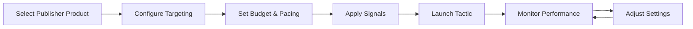

## Overview

**Tactics** are the execution layer within campaigns - specific targeting and optimization combinations that deliver your campaign objectives. Each tactic represents a unique combination of audience signals, brand story targeting, publisher inventory, and budget allocation.

Tactics can be managed in two ways:

<Note>
**Scope3 Algorithms (Default)**: Tactics are automatically generated and optimized by the platform's AI based on campaign objectives and performance data.
</Note>

<Note>
**Custom Algorithms**: You can manually create and manage tactics for direct control over targeting, budget allocation, and optimization strategies.
</Note>

## Tactic Components

### Core Elements

Every tactic combines several key components:

- **Publisher Product**: Specific inventory placement or ad format from a publisher
- **Targeting Strategy**: Audience parameters, demographics, and behavioral targeting
- **Signals**: Custom signals and audience segments for precise targeting
- **Brand Stories**: AI-generated audience profiles for audience definition
- **Budget Allocation**: Daily spend limits, total budget, and pacing controls
- **Pricing Strategy**: Target CPM, bid floors, and optimization goals
- **Performance Tracking**: Real-time metrics and attribution data

## Tactic Management Modes

### Scope3 Algorithms (AI-Generated)

By default, tactics are automatically generated and optimized:


**AI-Generated Lifecycle:**
1. **Generation** - AI creates initial tactic combinations based on campaign objectives
2. **Launch** - Tactics begin serving ads and collecting performance data
3. **Learning** - Algorithm analyzes performance across different signals and audiences
4. **Optimization** - Budget shifts to high-performing tactics, underperformers are paused
5. **Evolution** - New tactics are generated based on learnings

### Custom Algorithms (Manual Management)

For direct control, you can manually create and manage tactics:



**Manual Configuration Process:**
1. **Selection** - Choose publisher products and inventory placements
2. **Configuration** - Set targeting parameters and audience segments
3. **Allocation** - Configure budget, pacing, and pricing strategy
4. **Launch** - Activate tactic and begin serving ads
5. **Optimization** - Monitor performance and adjust settings as needed

## Creating Manual Tactics

### Basic Setup

```javascript
const tactic = await createInventoryOption({
  brandAgentId: "ba_123",
  campaignId: "camp_456", 
  publisherProductId: "pub_789",
  budgetAllocation: {
    amount: 5000,
    currency: "USD",
    dailyCap: 200,
    pacing: "even"
  },
  targeting: {
    ageGroups: ["25-34", "35-44"],
    interests: ["technology", "business"],
    geoTargeting: {
      countries: ["US", "CA"],
      cities: ["New York", "Los Angeles", "Toronto"]
    }
  },
  signalConfiguration: {
    customSignals: ["high_value_customers", "recent_visitors"],
    brandStories: ["tech_professionals"]
  }
});
```

### Advanced Configuration

```javascript
// Complex tactic with detailed targeting and optimization
const advancedTactic = await createInventoryOption({
  brandAgentId: "ba_123",
  campaignId: "camp_456",
  publisherProductId: "pub_premium_video",
  budgetAllocation: {
    amount: 10000,
    currency: "USD", 
    dailyCap: 500,
    pacing: "front_loaded",
    bidStrategy: {
      targetCPM: 8.50,
      bidFloor: 6.00,
      maxBid: 15.00
    }
  },
  targeting: {
    demographics: {
      ageGroups: ["25-34", "35-44"],
      income: ["75k-100k", "100k+"],
      education: ["college", "graduate"]  
    },
    behavioral: {
      interests: ["luxury_goods", "technology", "travel"],
      purchaseIntent: ["high"],
      deviceTypes: ["mobile", "desktop"]
    },
    contextual: {
      contentCategories: ["business", "technology", "lifestyle"],
      brandSafety: "strict",
      viewabilityThreshold: 0.7
    }
  },
  signalConfiguration: {
    customSignals: [
      "vip_customers",
      "high_ltv_segments", 
      "recent_purchasers"
    ],
    brandStories: ["luxury_tech_buyers"],
    thirdPartySignals: [] // Coming soon
  },
  optimizationGoals: {
    primary: "conversions",
    secondary: "brand_lift",
    kpi: "roas"
  }
});
```

## Managing Tactics

### List Campaign Tactics

```javascript
const tactics = await listInventoryOptions({
  campaignId: "camp_123"
});

// View all configured tactics
console.log(`Found ${tactics.length} tactics`);
tactics.forEach(tactic => {
  console.log(`• ${tactic.name}: $${tactic.budgetAllocation.amount}`);
});
```

### Update Tactic Configuration

```javascript
// Adjust budget allocation based on performance
const updatedTactic = await updateInventoryOption({
  inventoryOptionId: "inv_789",
  budgetAllocation: {
    amount: 7500, // Increased budget
    dailyCap: 300, // Higher daily cap
    pacing: "even"
  },
  targeting: {
    // Add new audience segments
    ageGroups: ["25-34", "35-44", "45-54"],
    interests: ["technology", "business", "finance"]
  }
});
```

### Budget Optimization

```javascript
// Adjust budget allocation between tactics
await adjustInventoryAllocation({
  campaignId: "camp_123",
  adjustments: [
    { inventoryOptionId: "inv_123", newAllocation: 6000 }, // Increase
    { inventoryOptionId: "inv_456", newAllocation: 3000 }, // Decrease  
    { inventoryOptionId: "inv_789", newAllocation: 4000 }  // Maintain
  ]
});
```

## Performance Analysis

### Signal Performance Analysis

Track how different audience signals perform across tactics to understand what drives results:

```javascript
const analysis = await analyzeTactics({
  campaignId: "camp_123",
  analysisType: "signals",
  compareSignals: true
});

// Returns signal effectiveness rankings:
// - "age_25_34": 89% efficiency score
// - "interest_sports": 76% efficiency score  
// - "behavior_premium_shopper": 92% efficiency score
```

**Key Metrics for Signal Analysis:**
- **Effectiveness Score**: Conversion rate relative to cost
- **Reach**: Total impressions across tactics using this signal
- **Efficiency**: Cost per conversion for signal-targeted tactics
- **Recommendation**: Scale up, monitor, or reduce allocation

### Brand Story Optimization

Understand which audience approaches drive the best performance:

```javascript
const audienceAnalysis = await analyzeTactics({
  campaignId: "camp_123", 
  analysisType: "brand_stories",
  compareStories: true
});

// Returns audience performance breakdown:
// - "performance" audience: 15% higher CTR
// - "lifestyle" audience: 32% better completion rates
// - "value" audience: 8% lower CPM
```

**Audience Performance Indicators:**
- **Engagement Score**: Click-through and completion rates
- **Conversion Effectiveness**: How well the audience converts
- **Cost Efficiency**: CPM and CPA performance
- **Reach Potential**: Available inventory and scale

### Tactic Efficiency Analysis

Get comprehensive efficiency rankings across all tactics:

```javascript
const efficiency = await analyzeTactics({
  campaignId: "camp_123",
  analysisType: "efficiency"
});

// Returns ranked tactic performance with insights:
// 🥇 Tactic #1: Sports Enthusiasts + Premium Video
//    • Efficiency: 92%
//    • CPM: $2.15 (below target)
//    • Conversions: 847
//    • Recommendation: Scale budget allocation
```

### Attribution Analysis

Understand how tactics contribute to the conversion funnel:

```javascript
const attribution = await analyzeTactics({
  campaignId: "camp_123",
  analysisType: "attribution"
});

// Shows conversion path effectiveness:
// 📊 Tactic Attribution Analysis
//    • First-touch heavy: Upper funnel awareness tactics
//    • Last-touch heavy: Lower funnel conversion tactics
//    • Assist-heavy: Mid-funnel consideration tactics
```

## Data Export & Integration

### Tactic-Level Data Export

Export granular tactic performance data for external analysis:

```javascript
const exportData = await exportCampaignData({
  brandAgentId: "ba_123",
  dateRange: { 
    start: "2024-01-01", 
    end: "2024-01-31" 
  },
  datasets: ["delivery", "events", "tactics"],
  groupBy: ["date", "campaign", "tactic", "signal"],
  format: "parquet",
  compression: "gzip"
});
```

**Available Grouping Options:**
- **By Tactic**: Individual tactic performance
- **By Signal**: Performance across signal combinations
- **By Brand Story**: Audience approach effectiveness
- **By Publisher**: Inventory source performance
- **By Date**: Time-series analysis

### Real-time Monitoring

Monitor tactic performance in real-time through campaign summaries:

```javascript
const summary = await getCampaignSummary({
  campaignId: "camp_123"
});

// Returns tactic insights:
// ⚡ Top Performing Tactics
//    1. Sports + Premium Video: $1.85 CPM, 12.3% CTR
//    2. Lifestyle + Display: $2.12 CPM, 8.7% CTR
//    3. Value + Native: $1.94 CPM, 9.2% CTR
```

## Optimization Best Practices

### 1. Monitor Signal Performance
- Track which audience signals consistently perform well
- Look for signals that work across multiple campaigns
- Identify underperforming signals that may need campaign prompt adjustments

### 2. Analyze Audience Effectiveness
- Compare brand story performance within campaigns
- Note which audience approaches resonate with your brand
- Use insights to refine future campaign targeting prompts

### 3. Budget Reallocation
- Let AI handle automatic budget shifting to high performers
- Use efficiency analysis to understand why tactics succeed or fail
- Consider campaign prompt adjustments for consistently underperforming patterns

### 4. Creative Alignment
- Ensure creatives align with the brand stories being targeted
- High-performing tactics may indicate creative messaging that resonates
- Poor tactic performance could signal creative-audience misalignment

## Integration with Campaign Management

### Tactic Data in Campaign Decisions

Tactic performance directly informs campaign optimization strategies:

**High-Level Indicators:**
- **Tactic Count**: More tactics indicate broader targeting experimentation
- **Performance Distribution**: Concentration vs. spread of successful tactics  
- **Signal Diversity**: Variety of successful targeting approaches
- **Story Effectiveness**: Which brand stories drive results

**Optimization Triggers:**
- **Underperforming Tactics**: May indicate poor creative fit or oversaturation
- **Signal Concentration**: High performance in specific demographics
- **Audience Insights**: Successful narrative approaches to scale
- **Inventory Performance**: Publisher and format preferences

### Campaign-Level Actions Based on Tactic Performance

```javascript
// Example: Adjust campaign based on tactic insights
const tacticsAnalysis = await analyzeTactics({
  campaignId: "camp_123", 
  analysisType: "optimization"
});

// If analysis shows consistent patterns, consider:
// 1. Campaign prompt refinement
// 2. Creative alignment adjustments  
// 3. Budget increases for successful patterns
// 4. New campaigns targeting discovered audiences
```

## Tactic API Reference

<CardGroup cols={2}>
  <Card title="Create Tactic" href="/api-reference/create_inventory_option" icon="plus">
    **Manual Tactic Creation**
    
    Create manually configured tactics with precise targeting, budget allocation, and signal configuration.
  </Card>
  
  <Card title="List Tactics" href="/api-reference/list_inventory_options" icon="list">
    **View Campaign Tactics**
    
    List all tactics for a campaign including both AI-generated and manually configured tactics.
  </Card>
  
  <Card title="Adjust Budget" href="/api-reference/adjust_inventory_allocation" icon="scale-balanced">
    **Budget Optimization**
    
    Reallocate budget between tactics based on performance data and strategic priorities.
  </Card>
  
  <Card title="Analyze Performance" href="/api-reference/analyze_tactics" icon="microscope">
    **Deep Performance Analysis**
    
    Statistical analysis of tactic performance with ML insights, signal effectiveness, and optimization recommendations.
  </Card>
</CardGroup>

## Understanding Tactic Performance

### Success Indicators

**High-Performing Tactics Display:**
- Consistent delivery at or below target CPM
- Strong conversion rates relative to campaign objectives
- Efficient use of budget allocation
- Good creative completion rates (for video)

**Optimization Signals:**
- **Scale Opportunities**: Below-target CPM with good performance
- **Creative Refresh Needs**: Poor completion or engagement rates
- **Audience Refinement**: Inconsistent signal performance
- **Budget Reallocation**: Clear performance tiers among tactics

### Troubleshooting Poor Tactic Performance

**Common Issues:**
1. **Creative-Audience Mismatch**: High-quality creative not resonating with targeted audience
2. **Oversaturated Signals**: Targeting approach reaching audience fatigue
3. **Budget Constraints**: High-performing tactics limited by daily budget caps
4. **Inventory Competition**: Premium placements driving up costs

**Diagnostic Steps:**
1. Run efficiency analysis to identify performance gaps
2. Compare signal effectiveness across tactics
3. Analyze creative performance in context of audiences
4. Review campaign prompt alignment with successful tactics

## Next Steps

<CardGroup cols={2}>
  <Card title="Signal Guide" href="/object-guides/signal" icon="radar">
    **Understanding Audience Signals**
    
    Deep dive into how audience signals drive tactic targeting and performance optimization.
  </Card>
  
  <Card title="Campaign Optimization" href="/object-guides/campaign" icon="bullseye-arrow">
    **Campaign-Level Strategy**
    
    Learn how tactic insights inform broader campaign strategy and optimization decisions.
  </Card>
</CardGroup>